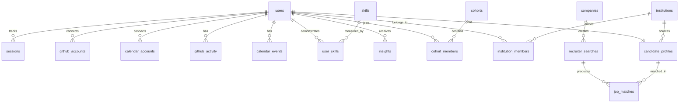

# Data Model: Antarix Verified Skill Proof Ecosystem

**Branch**: `001-antarix-complete-workflow` | **Date**: 2026-06-04

## Entity Relationship Overview

## Entities

### users

Primary identity for all actors on the platform.

| Field | Type | Constraints | Description |
|-------|------|-------------|-------------|
| id | UUID | PK, default gen_random_uuid() | Unique identifier |
| email | VARCHAR(255) | NOT NULL, UNIQUE | Login email |
| display_name | VARCHAR(100) | | User's display name |
| user_type | ENUM('student', 'professional') | DEFAULT 'student' | Account type |
| goals | JSONB | | Array of selected goals: Placement, DSA, AI/ML, Startup, Research, Freelancing |
| skill_level | ENUM('beginner', 'intermediate', 'advanced') | | Self-assessed level |
| working_hours_start | INT | | Preferred start hour (0-23) |
| working_hours_end | INT | | Preferred end hour (0-23) |
| onboarding_step | VARCHAR(50) | DEFAULT 'signup' | Current step: signup, profile, github, calendar, complete |
| onboarding_completed_at | TIMESTAMPTZ | | When onboarding finished |
| avatar_url | TEXT | | Profile picture URL |
| role | ENUM('student', 'placement_officer', 'recruiter', 'admin') | DEFAULT 'student' | Platform role for RLS |
| created_at | TIMESTAMPTZ | DEFAULT now() | |
| updated_at | TIMESTAMPTZ | DEFAULT now() | |

**State transitions**: `signup` → `profile` → `github` → `calendar` → `complete`

---

### sessions

Tracked work sessions from the Chrome extension.

| Field | Type | Constraints | Description |
|-------|------|-------------|-------------|
| id | UUID | PK | |
| user_id | UUID | FK → users(id), NOT NULL | |
| category | VARCHAR(50) | NOT NULL | DSA, Coding, Project, Learning, Research |
| project_name | VARCHAR(255) | | Optional project name |
| started_at | TIMESTAMPTZ | NOT NULL | Session start |
| ended_at | TIMESTAMPTZ | | Session end |
| duration_minutes | INT | | Calculated duration |
| focus_level | ENUM('high', 'medium', 'low') | | Calculated from tracking data |
| quality_rating | INT | CHECK 1-5 | User self-rating |
| extensions_used | JSONB | | Array of domains visited |
| notes | TEXT | | User's session notes |
| synced_at | TIMESTAMPTZ | | When synced from extension |
| created_at | TIMESTAMPTZ | DEFAULT now() | |

**Indexes**: `(user_id, started_at DESC)`, `(user_id, category)`

---

### github_accounts

OAuth connections to GitHub.

| Field | Type | Constraints | Description |
|-------|------|-------------|-------------|
| id | UUID | PK | |
| user_id | UUID | FK → users(id), UNIQUE | One GitHub per user |
| github_id | BIGINT | NOT NULL | GitHub user ID |
| username | VARCHAR(100) | NOT NULL | GitHub username |
| access_token | TEXT | NOT NULL, ENCRYPTED | OAuth token |
| last_synced_at | TIMESTAMPTZ | | Last successful sync |
| status | ENUM('active', 'disconnected') | DEFAULT 'active' | Connection health |
| created_at | TIMESTAMPTZ | DEFAULT now() | |

---

### github_activity

Synced commit data.

| Field | Type | Constraints | Description |
|-------|------|-------------|-------------|
| id | UUID | PK | |
| user_id | UUID | FK → users(id), NOT NULL | |
| commit_hash | VARCHAR(40) | NOT NULL | Git SHA |
| repository_name | VARCHAR(255) | NOT NULL | Repo full name |
| primary_language | VARCHAR(50) | | Dominant language in commit |
| files_changed | INT | | Number of files |
| additions | INT | | Lines added |
| deletions | INT | | Lines removed |
| message | TEXT | | Commit message |
| committed_at | TIMESTAMPTZ | NOT NULL | Commit timestamp |
| created_at | TIMESTAMPTZ | DEFAULT now() | |

**Indexes**: `(user_id, committed_at DESC)`, `(user_id, primary_language)`
**Unique**: `(user_id, commit_hash)`

---

### calendar_accounts

OAuth connections to Google Calendar.

| Field | Type | Constraints | Description |
|-------|------|-------------|-------------|
| id | UUID | PK | |
| user_id | UUID | FK → users(id), UNIQUE | |
| access_token | TEXT | NOT NULL, ENCRYPTED | |
| refresh_token | TEXT | ENCRYPTED | |
| last_synced_at | TIMESTAMPTZ | |  |
| status | ENUM('active', 'disconnected') | DEFAULT 'active' | |
| created_at | TIMESTAMPTZ | DEFAULT now() | |

---

### calendar_events

Synced calendar data.

| Field | Type | Constraints | Description |
|-------|------|-------------|-------------|
| id | UUID | PK | |
| user_id | UUID | FK → users(id), NOT NULL | |
| event_id | VARCHAR(255) | NOT NULL | Google Calendar event ID |
| title | VARCHAR(255) | | Event title |
| start_at | TIMESTAMPTZ | NOT NULL | |
| end_at | TIMESTAMPTZ | | |
| event_type | VARCHAR(50) | | class, deadline, meeting, etc. |
| created_at | TIMESTAMPTZ | DEFAULT now() | |

**Unique**: `(user_id, event_id)`

---

### skills

Master skill catalog.

| Field | Type | Constraints | Description |
|-------|------|-------------|-------------|
| id | UUID | PK | |
| name | VARCHAR(100) | NOT NULL, UNIQUE | e.g., Machine Learning |
| category | VARCHAR(50) | NOT NULL | AI/ML, Infrastructure, Frontend, Backend, Language |
| difficulty_level | INT | CHECK 1-10 | |
| industry_demand | INT | CHECK 1-10 | |
| avg_hours_to_proficiency | INT | | Hours to reach intermediate |
| created_at | TIMESTAMPTZ | DEFAULT now() | |

---

### user_skills

Verified skill proof per user per skill.

| Field | Type | Constraints | Description |
|-------|------|-------------|-------------|
| id | UUID | PK | |
| user_id | UUID | FK → users(id), NOT NULL | |
| skill_id | UUID | FK → skills(id), NOT NULL | |
| hours_logged | INT | DEFAULT 0 | Verified hours |
| projects_completed | INT | DEFAULT 0 | Project count |
| avg_completion_rate | DECIMAL(3,2) | | 0.00–1.00 |
| avg_focus_quality | DECIMAL(3,2) | | 0.00–1.00 |
| proficiency_level | ENUM('beginner', 'intermediate', 'advanced', 'expert') | | Auto-calculated |
| skill_proof_score | INT | CHECK 0-100 | Weighted composite |
| last_project_date | DATE | | |
| validated_by_institution | BOOLEAN | DEFAULT false | College confirmation |
| created_at | TIMESTAMPTZ | DEFAULT now() | |
| updated_at | TIMESTAMPTZ | DEFAULT now() | |

**Unique**: `(user_id, skill_id)`
**Indexes**: `(user_id, skill_proof_score DESC)`

---

### insights

Generated behavioral insights.

| Field | Type | Constraints | Description |
|-------|------|-------------|-------------|
| id | UUID | PK | |
| user_id | UUID | FK → users(id), NOT NULL | |
| type | VARCHAR(50) | NOT NULL | peak_window, workflow_pattern, skill_detection, category_success |
| title | VARCHAR(255) | NOT NULL | |
| description | TEXT | | |
| metric_value | DECIMAL | | Primary metric (e.g., 2.3x multiplier) |
| metric_metadata | JSONB | | Type-specific data (e.g., {startHour, endHour} for peak_window) |
| data_points_count | INT | | Sessions/commits analyzed |
| confidence_score | DECIMAL(3,2) | CHECK 0-1 | |
| recommended_action | TEXT | | |
| generated_for_week | DATE | | Week this insight covers |
| created_at | TIMESTAMPTZ | DEFAULT now() | |

**Indexes**: `(user_id, created_at DESC)`, `(user_id, type)`

---

### cohorts

Student groups.

| Field | Type | Constraints | Description |
|-------|------|-------------|-------------|
| id | UUID | PK | |
| name | VARCHAR(255) | NOT NULL | e.g., CSE 2024 @ St Joseph's |
| description | TEXT | | |
| institution_id | UUID | FK → institutions(id), NULLABLE | Linked institution (optional) |
| member_count | INT | DEFAULT 0 | Denormalized count |
| cohort_type | ENUM('institutional', 'interest', 'custom') | | |
| created_at | TIMESTAMPTZ | DEFAULT now() | |

---

### cohort_members

| Field | Type | Constraints | Description |
|-------|------|-------------|-------------|
| id | UUID | PK | |
| cohort_id | UUID | FK → cohorts(id), NOT NULL | |
| user_id | UUID | FK → users(id), NOT NULL | |
| joined_at | TIMESTAMPTZ | DEFAULT now() | |

**Unique**: `(cohort_id, user_id)`

---

### institutions

Colleges and universities.

| Field | Type | Constraints | Description |
|-------|------|-------------|-------------|
| id | UUID | PK | |
| name | VARCHAR(255) | NOT NULL | |
| type | ENUM('college', 'university', 'bootcamp', 'corporate_training') | | |
| location | VARCHAR(255) | | Full address |
| city | VARCHAR(100) | | |
| country | VARCHAR(100) | DEFAULT 'India' | |
| subscription_tier | ENUM('starter', 'growth', 'enterprise') | | |
| subscription_start_date | DATE | | |
| annual_cost | INT | | In INR |
| total_students | INT | DEFAULT 0 | |
| tracked_students | INT | DEFAULT 0 | |
| placement_rate | DECIMAL(3,2) | | |
| avg_skill_proof_score | INT | | |
| created_at | TIMESTAMPTZ | DEFAULT now() | |

---

### institution_members

| Field | Type | Constraints | Description |
|-------|------|-------------|-------------|
| id | UUID | PK | |
| institution_id | UUID | FK → institutions(id), NOT NULL | |
| user_id | UUID | FK → users(id), NOT NULL | |
| role | ENUM('student', 'faculty', 'admin', 'placement_officer') | | |
| batch_year | INT | | e.g., 2024 |
| specialization | VARCHAR(100) | | e.g., CSE, ECE |
| joined_at | TIMESTAMPTZ | DEFAULT now() | |

**Unique**: `(institution_id, user_id)`
**Indexes**: `(institution_id, batch_year)`

---

### companies

Hiring organizations.

| Field | Type | Constraints | Description |
|-------|------|-------------|-------------|
| id | UUID | PK | |
| name | VARCHAR(255) | NOT NULL | |
| industry | VARCHAR(100) | | |
| location | VARCHAR(255) | | |
| subscription_tier | ENUM('startup', 'growth', 'enterprise') | | |
| subscription_start_date | DATE | | |
| monthly_cost | INT | | In USD |
| skill_preferences | JSONB | | Array of skill names |
| min_skill_proof_score | INT | | Minimum filter |
| preferred_batch_years | JSONB | | Array of years |
| preferred_locations | JSONB | | Array of cities |
| created_at | TIMESTAMPTZ | DEFAULT now() | |

---

### candidate_profiles

Aggregated searchable student record (denormalized, updated daily).

| Field | Type | Constraints | Description |
|-------|------|-------------|-------------|
| id | UUID | PK | |
| user_id | UUID | FK → users(id), UNIQUE | |
| institution_id | UUID | FK → institutions(id), NULLABLE | |
| overall_skill_proof_score | INT | DEFAULT 0 | 0-100 |
| primary_specialization | VARCHAR(100) | | Top skill name |
| specialization_scores | JSONB | | {skill: score} map |
| total_hours_logged | INT | DEFAULT 0 | |
| total_projects_completed | INT | DEFAULT 0 | |
| avg_project_completion_rate | DECIMAL(3,2) | | |
| avg_focus_quality | DECIMAL(3,2) | | |
| placement_ready | BOOLEAN | DEFAULT false | Score ≥80 AND hours ≥200 |
| is_public | BOOLEAN | DEFAULT false | Visible to companies |
| is_open_to_opportunities | BOOLEAN | DEFAULT false | Actively seeking |
| created_at | TIMESTAMPTZ | DEFAULT now() | |
| updated_at | TIMESTAMPTZ | DEFAULT now() | |

**Indexes**: `(overall_skill_proof_score DESC)`, `(placement_ready)`, `(is_open_to_opportunities)`

---

### recruiter_searches

Saved company searches.

| Field | Type | Constraints | Description |
|-------|------|-------------|-------------|
| id | UUID | PK | |
| company_id | UUID | FK → companies(id), NOT NULL | |
| search_name | VARCHAR(255) | | e.g., "ML Engineers Q1 2024" |
| skill_filters | JSONB | | Array of skill names |
| min_skill_proof_score | INT | | |
| batch_years | JSONB | | Array of years |
| locations | JSONB | | Array of cities |
| candidates_found | INT | DEFAULT 0 | |
| candidates_reached | INT | DEFAULT 0 | |
| interviews_scheduled | INT | DEFAULT 0 | |
| hires | INT | DEFAULT 0 | |
| created_at | TIMESTAMPTZ | DEFAULT now() | |
| updated_at | TIMESTAMPTZ | DEFAULT now() | |

---

### job_matches

Candidate-to-search pairings with pipeline tracking.

| Field | Type | Constraints | Description |
|-------|------|-------------|-------------|
| id | UUID | PK | |
| recruiter_search_id | UUID | FK → recruiter_searches(id) | |
| candidate_id | UUID | FK → candidate_profiles(id) | |
| match_score | INT | CHECK 0-100 | Overall match |
| skills_match | INT | CHECK 0-100 | Skill alignment |
| experience_match | INT | CHECK 0-100 | Hours/projects alignment |
| availability_match | INT | CHECK 0-100 | Schedule alignment |
| status | ENUM('matched', 'reached_out', 'interview_scheduled', 'interview_completed', 'hired', 'rejected') | DEFAULT 'matched' | Pipeline stage |
| reached_out_at | TIMESTAMPTZ | | |
| interview_scheduled_at | TIMESTAMPTZ | | |
| interview_completed_at | TIMESTAMPTZ | | |
| hired_at | TIMESTAMPTZ | | |
| created_at | TIMESTAMPTZ | DEFAULT now() | |

**State transitions**: `matched` → `reached_out` → `interview_scheduled` → `interview_completed` → `hired` | `rejected`

## Row Level Security Policies

| Table | Policy | Rule |
|-------|--------|------|
| users | Users read own data | `auth.uid() = id` |
| sessions | Students read/write own | `auth.uid() = user_id` |
| github_activity | Students read own | `auth.uid() = user_id` |
| insights | Students read own | `auth.uid() = user_id` |
| institution_members | Placement officers read own institution | `institution_id IN (SELECT institution_id FROM institution_members WHERE user_id = auth.uid() AND role = 'placement_officer')` |
| candidate_profiles | Companies read public profiles | `is_public = true AND is_open_to_opportunities = true` |
| candidate_profiles | Students read/write own | `auth.uid() = user_id` |
