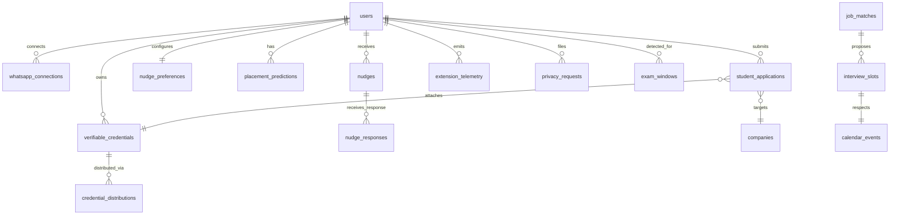

# Data Model: Antarix 11/10 — Verified Skill Intelligence Platform

**Branch**: `002-antarix-definitive-vision` | **Date**: 2026-06-04
**Builds on**: `specs/001-antarix-complete-workflow/data-model.md` (17 baseline entities)

This document specifies only the **new and changed** entities introduced by the 11/10 vision. Existing entities (users, sessions, github_accounts, github_activity, calendar_accounts, calendar_events, skills, user_skills, insights, cohorts, cohort_members, institutions, institution_members, companies, candidate_profiles, recruiter_searches, job_matches) remain in place with the targeted deltas noted in the **Schema Deltas** section below.

## Entity Relationship Additions

## New Entities

### whatsapp_connections

A student's authorized link to the WhatsApp Business API.

| Field | Type | Constraints | Description |
|-------|------|-------------|-------------|
| id | UUID | PK | |
| user_id | UUID | FK → users(id), UNIQUE | One WhatsApp per user |
| phone_number | VARCHAR(20) | NOT NULL | E.164 format |
| provider | ENUM('meta_cloud', 'twilio') | DEFAULT 'meta_cloud' | |
| provider_phone_id | VARCHAR(64) | | WhatsApp Business phone number ID |
| opt_in_at | TIMESTAMPTZ | NOT NULL | When the student opted in |
| opt_out_at | TIMESTAMPTZ | | When the student opted out |
| last_delivery_at | TIMESTAMPTZ | | Last successful delivery |
| last_error | TEXT | | Last delivery error, if any |
| status | ENUM('active', 'paused', 'opt_out', 'disconnected', 'error') | DEFAULT 'active' | |
| created_at | TIMESTAMPTZ | DEFAULT now() | |
| updated_at | TIMESTAMPTZ | DEFAULT now() | |

**State transitions**: `active` ↔ `paused` (student toggle) | `active` → `opt_out` (irreversible from student's side; can re-opt-in) | `*` → `disconnected` (provider returned 401/403)

---

### nudge_preferences

Per-student nudge configuration. One row per user.

| Field | Type | Constraints | Description |
|-------|------|-------------|-------------|
| user_id | UUID | PK, FK → users(id) | |
| timezone | VARCHAR(64) | NOT NULL | IANA tz, e.g., `Asia/Kolkata` |
| daily_send_local_time | TIME | DEFAULT '08:00' | Daily morning nudge send time, local |
| weekly_send_local_day | SMALLINT | DEFAULT 0 | 0 = Sunday |
| weekly_send_local_time | TIME | DEFAULT '10:00' | Weekly summary send time, local |
| quiet_hours_start | TIME | DEFAULT '22:00' | Local |
| quiet_hours_end | TIME | DEFAULT '07:00' | Local |
| pause_all | BOOLEAN | DEFAULT false | Master "do not contact" switch |
| real_time_peak_nudges | BOOLEAN | DEFAULT true | Per-student toggle for real-time peak-window nudges |
| streak_risk_nudges | BOOLEAN | DEFAULT true | Per-student toggle for streak-at-risk alerts |
| whatsapp_channel | BOOLEAN | DEFAULT true | |
| push_channel | BOOLEAN | DEFAULT true | |
| dashboard_channel | BOOLEAN | DEFAULT true | |
| updated_at | TIMESTAMPTZ | DEFAULT now() | |

**Validation**: `quiet_hours_start != quiet_hours_end` (allow wrap-around midnight).

---

### nudges

Every AI Coach message that the system attempts to deliver.

| Field | Type | Constraints | Description |
|-------|------|-------------|-------------|
| id | UUID | PK | |
| user_id | UUID | FK → users(id), NOT NULL | |
| type | ENUM('daily_morning', 'real_time_peak', 'streak_risk', 'weekly_summary', 'verification', 'pause_confirmation') | NOT NULL | |
| channel | ENUM('whatsapp', 'push', 'dashboard') | NOT NULL | Channel actually used for delivery |
| template_id | VARCHAR(64) | NOT NULL | Which template was rendered |
| trigger_source | ENUM('cron', 'event_commit', 'event_score_recomputed', 'event_calendar_window_opened', 'event_exam_detected', 'student_reply') | NOT NULL | |
| personalization_context | JSONB | | Inputs fetched for rendering (peak hours, streak, free windows) |
| rendered_body | TEXT | | Final message content sent |
| send_after | TIMESTAMPTZ | NOT NULL | Scheduled earliest send time (respects quiet hours) |
| sent_at | TIMESTAMPTZ | | Actual send time |
| delivery_status | ENUM('queued', 'sent', 'delivered', 'read', 'failed', 'suppressed_quiet_hours', 'suppressed_exam_week', 'suppressed_paused', 'suppressed_opt_out') | DEFAULT 'queued' | |
| failure_reason | TEXT | | |
| created_at | TIMESTAMPTZ | DEFAULT now() | |

**Indexes**: `(user_id, created_at DESC)`, `(user_id, type, created_at DESC)`, `(send_after) WHERE delivery_status = 'queued'`
**Suppress invariants**: A nudge MUST NOT be sent if `nudge_preferences.pause_all = true`, if the current local time is within quiet hours, if the channel is opted out, or (for real-time types) if an exam week is detected.

---

### nudge_responses

A student's reply to a WhatsApp nudge, or a click-through on a push/dashboard nudge.

| Field | Type | Constraints | Description |
|-------|------|-------------|-------------|
| id | UUID | PK | |
| nudge_id | UUID | FK → nudges(id), NOT NULL | |
| user_id | UUID | FK → users(id), NOT NULL | Denormalized for index |
| channel | ENUM('whatsapp', 'push', 'dashboard') | NOT NULL | |
| response_kind | ENUM('command', 'click', 'reply_text') | NOT NULL | |
| command | ENUM('START', 'DONE', 'STATS', 'RANK', 'HELP', 'PAUSE', 'RESUME') | | For `response_kind = 'command'` |
| raw_text | TEXT | | For `response_kind = 'reply_text'` |
| target_url | TEXT | | For `response_kind = 'click'` |
| state_change | JSONB | | Documented effect of the response (e.g., ad-hoc session started) |
| received_at | TIMESTAMPTZ | DEFAULT now() | |

**Indexes**: `(user_id, received_at DESC)`, `(nudge_id)`

---

### placement_predictions

A point-in-time ML/heuristic inference for a student. One row per (student, weekly run).

| Field | Type | Constraints | Description |
|-------|------|-------------|-------------|
| id | UUID | PK | |
| user_id | UUID | FK → users(id), NOT NULL | |
| run_week | DATE | NOT NULL | Week this prediction covers (Monday) |
| probability_0_100 | INT | CHECK 0-100, NOT NULL | Placement probability |
| company_tier | ENUM('tier_1', 'tier_2', 'tier_3') | NOT NULL | |
| time_to_ready_months | DECIMAL(3,1) | | Estimated months until placement-ready threshold |
| top_gaps | JSONB | | `[{skill_id, gap_score, recommended_action}, ...]` top 3 |
| input_features | JSONB | | Snapshot of all inputs (for audit + future model retraining) |
| model_version | VARCHAR(32) | NOT NULL | Which scorer produced this prediction |
| computed_at | TIMESTAMPTZ | DEFAULT now() | |

**Unique**: `(user_id, run_week)`
**Indexes**: `(user_id, computed_at DESC)`

---

### verifiable_credentials

A student's exportable proof. One row per (student); the row is updated (and a snapshot is taken) when the score changes by a documented threshold.

| Field | Type | Constraints | Description |
|-------|------|-------------|-------------|
| id | UUID | PK | |
| user_id | UUID | FK → users(id), UNIQUE | |
| public_slug | VARCHAR(32) | UNIQUE, NOT NULL | URL-safe, unguessable |
| snapshot_overall_score | INT | NOT NULL | Score at last issuance |
| snapshot_per_skill | JSONB | | `{skill_name: proficiency}` |
| snapshot_activity_totals | JSONB | | Hours, projects, etc. |
| snapshot_cohort_percentile | INT | | |
| snapshot_taken_at | TIMESTAMPTZ | NOT NULL | |
| last_verified_at | TIMESTAMPTZ | | Most recent public-page render |
| verification_count | BIGINT | DEFAULT 0 | How many times the public page was opened |
| revocation_status | ENUM('active', 'revoked') | DEFAULT 'active' | |
| revoked_at | TIMESTAMPTZ | | |
| issued_at | TIMESTAMPTZ | DEFAULT now() | |
| updated_at | TIMESTAMPTZ | DEFAULT now() | |

**Public page semantics**: `antarix.app/verify/{slug}` always shows the current live score; if it differs from `snapshot_*` fields by more than the documented threshold, the page shows the live score with a "score has changed since last issuance" disclosure. `revocation_status = 'revoked'` shows "credential revoked".

---

### credential_distributions

How a credential has been distributed (PDF downloads, QR generations, LinkedIn badge shares).

| Field | Type | Constraints | Description |
|-------|------|-------------|-------------|
| id | UUID | PK | |
| credential_id | UUID | FK → verifiable_credentials(id), NOT NULL | |
| channel | ENUM('link', 'pdf', 'qr', 'linkedin_badge') | NOT NULL | |
| generated_at | TIMESTAMPTZ | DEFAULT now() | |
| artifact_url | TEXT | | For `pdf` and `qr` (Storage URL) |

**Unique**: `(credential_id, channel)` — one artifact per channel per credential version (regenerated on snapshot change).

---

### student_applications

A student's one-click application to a company, attached to a credential snapshot at the moment of application.

| Field | Type | Constraints | Description |
|-------|------|-------------|-------------|
| id | UUID | PK | |
| student_user_id | UUID | FK → users(id), NOT NULL | |
| company_id | UUID | FK → companies(id), NOT NULL | |
| credential_snapshot_id | UUID | FK → verifiable_credentials(id), NOT NULL | Point-in-time credential |
| status | ENUM('submitted', 'viewed_by_company', 'interview_proposed', 'interview_accepted', 'rejected', 'withdrawn') | DEFAULT 'submitted' | |
| applied_at | TIMESTAMPTZ | DEFAULT now() | |
| updated_at | TIMESTAMPTZ | DEFAULT now() | |

**Unique**: `(student_user_id, company_id)` — one active application per student–company pair.
**Indexes**: `(company_id, status, applied_at DESC)`

---

### extension_telemetry

Heartbeats from the Power Mode Chrome Extension. Used to drive the ⚡ Power Mode badge freshness.

| Field | Type | Constraints | Description |
|-------|------|-------------|-------------|
| id | BIGSERIAL | PK | |
| user_id | UUID | FK → users(id), NOT NULL | |
| extension_version | VARCHAR(32) | NOT NULL | |
| last_heartbeat_at | TIMESTAMPTZ | NOT NULL | When the extension last reported in |
| browser | VARCHAR(32) | | e.g., `chrome` |
| created_at | TIMESTAMPTZ | DEFAULT now() | |

**Indexes**: `(user_id, last_heartbeat_at DESC)`
**Badge rule**: ⚡ Power Mode badge is shown when any telemetry row for the user has `last_heartbeat_at` within the documented freshness window (target: 24 hours).

---

### privacy_requests

A log of all privacy-affecting actions for audit and SLAs.

| Field | Type | Constraints | Description |
|-------|------|-------------|-------------|
| id | UUID | PK | |
| user_id | UUID | FK → users(id), NOT NULL | |
| request_type | ENUM('account_deletion', 'company_search_opt_out', 'company_search_opt_in', 'data_export', 'source_disconnect') | NOT NULL | |
| status | ENUM('pending', 'in_progress', 'completed', 'failed') | DEFAULT 'pending' | |
| requested_at | TIMESTAMPTZ | DEFAULT now() | |
| completed_at | TIMESTAMPTZ | | |
| details | JSONB | | Request-specific (e.g., `{source: 'github'}` for source_disconnect) |

**Indexes**: `(user_id, requested_at DESC)`, `(status, request_type) WHERE status IN ('pending', 'in_progress')`

---

### exam_windows

Auto-detected dense "exam" calendar blocks during which real-time peak nudges are suppressed.

| Field | Type | Constraints | Description |
|-------|------|-------------|-------------|
| id | UUID | PK | |
| user_id | UUID | FK → users(id), NOT NULL | |
| start_date | DATE | NOT NULL | |
| end_date | DATE | NOT NULL | |
| detection_basis | ENUM('keyword_density', 'all_day_blocks', 'manual_flag') | NOT NULL | |
| confidence | DECIMAL(3,2) | CHECK 0-1 | |
| created_at | TIMESTAMPTZ | DEFAULT now() | |

**Unique**: `(user_id, start_date, end_date)`

---

### interview_slots

A proposed interview time slot, generated by intersecting calendars and the candidate's peak window.

| Field | Type | Constraints | Description |
|-------|------|-------------|-------------|
| id | UUID | PK | |
| job_match_id | UUID | FK → job_matches(id), NOT NULL | |
| candidate_user_id | UUID | FK → users(id), NOT NULL | |
| starts_at | TIMESTAMPTZ | NOT NULL | |
| ends_at | TIMESTAMPTZ | NOT NULL | |
| candidate_peak_window_match | BOOLEAN | | True if the slot overlaps the candidate's confirmed peak window |
| candidate_calendar_free | BOOLEAN | | True if the candidate's calendar has no conflicting event |
| interviewer_calendar_free | BOOLEAN | | True if the interviewer's calendar has no conflicting event |
| status | ENUM('proposed', 'accepted', 'declined', 'rescheduled', 'completed') | DEFAULT 'proposed' | |
| created_at | TIMESTAMPTZ | DEFAULT now() | |

**Indexes**: `(job_match_id)`, `(candidate_user_id, starts_at)`

---

## Schema Deltas to 001 Baseline

The following **additive changes** to 001's existing tables are required for 002. No existing columns are removed or renamed.

### users (add columns)
- `whatsapp_opt_in` BOOLEAN DEFAULT false
- `company_search_visible` BOOLEAN DEFAULT true  *(default true, but opt-out flips it; matches FR-016)*
- `power_mode_active` BOOLEAN DEFAULT false  *(denormalized; the source of truth is `extension_telemetry` freshness)*
- `power_mode_badge_shown_at` TIMESTAMPTZ
- `placement_prediction_current_id` UUID NULL FK → placement_predictions(id)
- `verifiable_credential_id` UUID NULL FK → verifiable_credentials(id)
- `deletion_requested_at` TIMESTAMPTZ
- `deletion_purge_after` TIMESTAMPTZ

### github_accounts (add columns)
- `last_error` TEXT
- `last_error_at` TIMESTAMPTZ
- `scope` ENUM('public_only', 'public_and_private') DEFAULT 'public_only'

### calendar_accounts (add columns)
- `last_error` TEXT
- `last_error_at` TIMESTAMPTZ

### sessions (add columns)
- `extension_version` VARCHAR(32)
- `sync_status` ENUM('pending', 'synced', 'failed') DEFAULT 'pending'
- `sync_error` TEXT

### calendar_events (add columns)
- `derived_event_type` ENUM('class', 'deadline', 'meeting', 'study_group', 'exam', 'other')  *(derived; updated on sync)*
- `is_all_day` BOOLEAN DEFAULT false
- `attendee_count` INT

### job_matches (add columns)
- `interview_scheduling_state` ENUM('not_started', 'slots_proposed', 'slots_accepted', 'completed', 'declined') DEFAULT 'not_started'

### candidate_profiles (add columns)
- `last_score_change_at` TIMESTAMPTZ
- `peak_window_start_local_hour` SMALLINT
- `peak_window_end_local_hour` SMALLINT
- `power_mode_bonus_active` BOOLEAN DEFAULT false

### companies (add columns)
- `monthly_search_credit_balance` INT DEFAULT 0
- `monthly_search_credit_reset_at` TIMESTAMPTZ

### recruiter_searches (add columns)
- `last_run_at` TIMESTAMPTZ
- `last_results_count` INT

## Row Level Security — New Tables

| Table | Policy | Rule |
|-------|--------|------|
| whatsapp_connections | Student read/write own | `auth.uid() = user_id` |
| nudge_preferences | Student read/write own | `auth.uid() = user_id` |
| nudges | Student read own | `auth.uid() = user_id` |
| nudge_responses | Student read/write own | `auth.uid() = user_id` |
| placement_predictions | Student read own | `auth.uid() = user_id` |
| verifiable_credentials | Student read/write own | `auth.uid() = user_id` |
| verifiable_credentials | Public read by slug | Anyone can `SELECT public_slug, snapshot_*, revocation_status` (no PII beyond display name) |
| credential_distributions | Student read/write own | `auth.uid() = user_id` (via credential) |
| student_applications | Student read/write own | `auth.uid() = student_user_id` |
| student_applications | Company read for own jobs | `company_id IN (SELECT company_id FROM company_members WHERE user_id = auth.uid())` |
| extension_telemetry | Student read own | `auth.uid() = user_id` |
| privacy_requests | Student read/write own | `auth.uid() = user_id` |
| exam_windows | Student read/write own | `auth.uid() = user_id` |
| interview_slots | Candidate read own | `auth.uid() = candidate_user_id` |
| interview_slots | Company read for own jobs | via `job_matches.recruiter_search_id → companies` |
