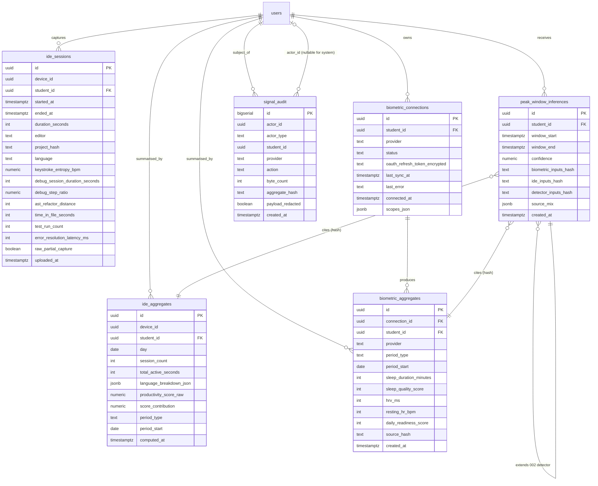

# Data Model: 006 — Deep Signal Capture

**Date**: 2026-06-06
**Status**: Phase 1 design ratified; 1 additive migration (039)
**Builds on**: 001-005 schema (042 existing migrations)

## Migration map

| Migration | Tables Added | Tables Extended | Notes |
|---|---|---|---|
| `039_deep_signal_capture.sql` | `ide_sessions`, `ide_aggregates`, `biometric_connections`, `biometric_aggregates`, `peak_window_inferences`, `signal_audit` | none | 6 new tables; 1 cron entry bundled in 043_cron_006.sql per project convention |

Total new tables: **6**. Total extended tables: **0** (we add new, never modify).

---

## ER diagram



---

## 039 — Deep Signal Capture

### `ide_sessions`
One row per ≤ 30-min coding session captured by the extension. The extension uploads at most one row per session; multiple sessions per day are normal.

| Column | Type | Constraints | Notes |
|---|---|---|---|
| `id` | uuid | PK, default `gen_random_uuid()` |  |
| `device_id` | uuid | NOT NULL | Per-install UUID generated client-side, stable across sessions for that install |
| `student_id` | uuid | NOT NULL, FK `users(id)` ON DELETE CASCADE | Denormalised for fast student lookup; cascade on user delete (DPDP erasure) |
| `started_at` | timestamptz | NOT NULL |  |
| `ended_at` | timestamptz | NOT NULL |  |
| `duration_seconds` | int | NOT NULL, CHECK between 60 and 1800 | 30 min cap; sub-60s sessions discarded client-side |
| `editor` | text | NOT NULL, CHECK in (`'vscode'`, `'cursor'`) |  |
| `project_hash` | text | NOT NULL | SHA-256 of project root path; never the path itself |
| `language` | text | NOT NULL | Most-frequent language in session; CHECK in 5 supported languages OR `'mixed'` |
| `keystroke_entropy_bpm` | numeric(6,2) | NOT NULL, CHECK between 0 and 20 | Bits per minute; Shannon entropy over key codes, no content |
| `debug_session_duration_seconds` | int | NOT NULL, default 0 |  |
| `debug_step_ratio` | numeric(4,2) | NOT NULL, default 0, CHECK between 0 and 1 | step events / total time |
| `ast_refactor_distance` | int | NOT NULL, default 0, CHECK >= 0 | nodes added + removed weighted by depth delta |
| `time_in_file_seconds` | int | NOT NULL, default 0 |  |
| `test_run_count` | int | NOT NULL, default 0 |  |
| `error_resolution_latency_ms` | int | NOT NULL, default 0 | ms from first diagnostic to cleared |
| `raw_partial_capture` | boolean | NOT NULL, default false | true if user revoked a sub-scope at OS level |
| `uploaded_at` | timestamptz | NOT NULL, default `now()` |  |

**Indexes**:
- `(student_id, started_at DESC)` — student history queries
- `(device_id, started_at DESC)` — device-scoped queries + purge
- `(uploaded_at)` — TTL GC

**Retention**: 30 days from `uploaded_at`, then rolled into `ide_aggregates` and hard-deleted. Rollup is irreversible (raw rows do not survive the rollup).

**RLS**: students see own (`student_id = auth.uid()`); service role full. RLS also enforces INSERT only via service role — the extension posts with a device-scoped JWT issued by the server (see `lib/signals/device-jwt.ts`).

---

### `ide_aggregates`
Daily or monthly rollup. Daily rows live for 30 days; monthly rows live indefinitely (until user erasure).

| Column | Type | Constraints | Notes |
|---|---|---|---|
| `id` | uuid | PK |  |
| `device_id` | uuid | NOT NULL |  |
| `student_id` | uuid | NOT NULL, FK `users(id)` ON DELETE CASCADE |  |
| `day` | date | NOT NULL | Used for daily rows; first day of month for monthly rows |
| `session_count` | int | NOT NULL, default 0, CHECK >= 0 |  |
| `total_active_seconds` | int | NOT NULL, default 0, CHECK >= 0 |  |
| `language_breakdown_json` | jsonb | NOT NULL, default `'{}'::jsonb` | e.g. `{"python": 0.6, "typescript": 0.4}` |
| `productivity_score_raw` | numeric(5,2) | NOT NULL, default 0, CHECK between 0 and 100 | Server-computed; never exposed to client pre-cap |
| `score_contribution` | numeric(4,2) | NOT NULL, default 0, CHECK between 0 and 3 | The capped contribution (3% ceiling) |
| `period_type` | text | NOT NULL, CHECK in (`'daily'`, `'monthly'`) |  |
| `period_start` | date | NOT NULL |  |
| `computed_at` | timestamptz | NOT NULL, default `now()` |  |

**Indexes**:
- `(student_id, period_start DESC)`
- `(student_id, period_type, period_start DESC)` — score aggregator lookup
- Partial unique: `(device_id, period_type, period_start) WHERE period_type = 'daily'`
- Partial unique: `(student_id, period_type, period_start) WHERE period_type = 'monthly'` (one monthly per student)

**RLS**: students see own; score aggregator (service role) full.

---

### `biometric_connections`
One row per (user, provider) OAuth connection. The OAuth refresh token is encrypted at rest with pgsodium.

| Column | Type | Constraints | Notes |
|---|---|---|---|
| `id` | uuid | PK |  |
| `student_id` | uuid | NOT NULL, FK `users(id)` ON DELETE CASCADE |  |
| `provider` | text | NOT NULL, CHECK in (`'healthkit'`, `'google_fit'`, `'oura'`, `'whoop'`) |  |
| `status` | text | NOT NULL, default `'connected'`, CHECK in (`'connected'`, `'expired'`, `'disconnected'`) |  |
| `oauth_refresh_token_encrypted` | text | nullable | pgsodium-encrypted; null for healthkit/google_fit (mobile-handled) |
| `last_sync_at` | timestamptz | nullable |  |
| `last_error` | text | nullable | Truncated to 500 chars |
| `connected_at` | timestamptz | NOT NULL, default `now()` |  |
| `scopes_json` | jsonb | NOT NULL | Enum: `["sleep", "hrv", "resting_hr", "readiness"]` — at least 1 required |

**Indexes**:
- `(student_id, provider)` UNIQUE — one connection per (user, provider)
- `(status, last_sync_at)` — nightly correlator scans active connections

**RLS**: students see own; service role full. The mobile-sync endpoint and the OAuth callback both write via service role.

---

### `biometric_aggregates`
Daily or monthly summary per provider. HealthKit / Google Fit rows come from the mobile app; Oura / Whoop rows come from the server-side `biometric-correlator`.

| Column | Type | Constraints | Notes |
|---|---|---|---|
| `id` | uuid | PK |  |
| `connection_id` | uuid | NOT NULL, FK `biometric_connections(id)` ON DELETE CASCADE |  |
| `student_id` | uuid | NOT NULL, FK `users(id)` ON DELETE CASCADE |  |
| `provider` | text | NOT NULL, CHECK in (`'healthkit'`, `'google_fit'`, `'oura'`, `'whoop'`) |  |
| `period_type` | text | NOT NULL, CHECK in (`'daily'`, `'monthly'`) |  |
| `period_start` | date | NOT NULL |  |
| `sleep_duration_minutes` | int | nullable, CHECK between 0 and 1440 |  |
| `sleep_quality_score` | int | nullable, CHECK between 0 and 100 | Provider-normalised; Oura/Whoop proprietary, mapped to 0-100 |
| `hrv_ms` | int | nullable, CHECK between 0 and 300 |  |
| `resting_hr_bpm` | int | nullable, CHECK between 20 and 200 |  |
| `daily_readiness_score` | int | nullable, CHECK between 0 and 100 | Provider-specific, normalised |
| `source_hash` | text | NOT NULL | SHA-256 of (provider, period_start, all numeric fields) — used to detect duplicate uploads |
| `created_at` | timestamptz | NOT NULL, default `now()` |  |

**Indexes**:
- `(student_id, provider, period_start DESC)`
- `(connection_id, period_type, period_start DESC)`
- Partial unique: `(connection_id, period_type, period_start) WHERE period_type = 'daily'`
- Partial unique: `(student_id, provider, period_type, period_start) WHERE period_type = 'monthly'`

**RLS**: students see own; service role full. The `source_hash` is exposed in the privacy center as the "what we learned" proof-of-content.

---

### `peak_window_inferences`
One row per inference cycle. The `biometric-correlator` edge function writes one row per active student per day. The 002 detector writes its own row independently — this table extends (does not replace) the 002 output.

| Column | Type | Constraints | Notes |
|---|---|---|---|
| `id` | uuid | PK |  |
| `student_id` | uuid | NOT NULL, FK `users(id)` ON DELETE CASCADE |  |
| `window_start` | timestamptz | NOT NULL |  |
| `window_end` | timestamptz | NOT NULL |  |
| `confidence` | numeric(3,2) | NOT NULL, CHECK between 0 and 1 |  |
| `biometric_inputs_hash` | text | nullable | SHA-256 of the biometric aggregates used; null if no biometric input |
| `ide_inputs_hash` | text | nullable | SHA-256 of the IDE aggregates used; null if no IDE input |
| `detector_inputs_hash` | text | NOT NULL | SHA-256 of the 002 detector output that this inference extends |
| `source_mix` | jsonb | NOT NULL, default `'{}'::jsonb` | e.g. `{"biometric": 0.3, "ide": 0.4, "002_detector": 0.3}` — weights used in the merge |
| `created_at` | timestamptz | NOT NULL, default `now()` |  |

**Indexes**:
- `(student_id, created_at DESC)` — student history
- `(created_at)` — nightly TTL rollup

**Retention**: 30 days from `created_at`, then hard-deleted (the 002 detector remains the source of truth for long-term windows).

**RLS**: students see own; service role full.

---

### `signal_audit`
Append-only audit log. Every signal upload — IDE aggregate, biometric aggregate, privacy-center page view, toggle flip, "Delete all" action, audit read by an admin — writes one row. The payload itself is never stored; only its hash, provider, byte count, and actor.

| Column | Type | Constraints | Notes |
|---|---|---|---|
| `id` | bigserial | PK |  |
| `actor_id` | uuid | nullable, FK `users(id)` | Null for system-actor events (e.g. nightly cron) |
| `actor_type` | text | NOT NULL, CHECK in (`'system'`, `'student'`, `'admin'`, `'college_admin'`) |  |
| `student_id` | uuid | NOT NULL, FK `users(id)` ON DELETE CASCADE | The data subject — the student whose data was touched |
| `provider` | text | NOT NULL, CHECK in (`'ide_vscode'`, `'ide_cursor'`, `'biometric_healthkit'`, `'biometric_google_fit'`, `'biometric_oura'`, `'biometric_whoop'`, `'privacy_center'`, `'admin_audit'`, `'dpdp_erasure'`) |  |
| `action` | text | NOT NULL, CHECK in (`'enable'`, `'disable'`, `'upload'`, `'read'`, `'delete_all'`, `'delete_one'`, `'audit_read'`, `'erasure_complete'`) |  |
| `byte_count` | int | NOT NULL, default 0, CHECK >= 0 | Size of the payload the audit is about; informational only |
| `aggregate_hash` | text | nullable | SHA-256 of the payload, never the payload itself; nullable for read/enable events |
| `payload_redacted` | boolean | NOT NULL, default true | Always true; column exists for future-proofing only |
| `created_at` | timestamptz | NOT NULL, default `now()` |  |

**Indexes**:
- `(student_id, created_at DESC)` — student audit dump
- `(provider, action, created_at DESC)` — provider-scoped monitoring
- `(actor_id, created_at DESC)` — actor activity

**Append-only enforcement**:
```sql
revoke update, delete on public.signal_audit from authenticated, anon, service_role;
```
The only allowed operation is `INSERT` via service role. The integrity check (`SC-PRI-001`) verifies this every night.

**Retention**: 7 years for the metadata (DPDP Section 8(4) record-of-processing). `actor_id` is pseudonymised after 90 days via a nightly job that replaces it with a salted hash of the original id (the salt is rotated yearly).

**RLS**: read-only for `college_admin` and `admin` (no insert/update/delete); students see ONLY rows where `student_id = auth.uid()` AND `action != 'audit_read'`; service role can INSERT only. The double layer (REVOKE + RLS) is intentional.

---

## Cross-table relationships (summary)

```
users
  ├── ide_sessions (student_id)
  ├── ide_aggregates (student_id)
  ├── biometric_connections (student_id)
  ├── biometric_aggregates (student_id)
  ├── peak_window_inferences (student_id)
  └── signal_audit (student_id, actor_id)

biometric_connections
  └── biometric_aggregates (connection_id)

peak_window_inferences
  ├── cites biometric_aggregates (hash only, no FK)
  ├── cites ide_aggregates (hash only, no FK)
  └── extends 002 peak_window_detector output (hash only)
```

All foreign keys cascade on user deletion (DPDP erasure). The 002 peak-window detector is *not* modified — we extend it by writing parallel rows in `peak_window_inferences` that cite it by hash.

---

## RLS summary

| Table | student sees | admin sees | service role | anon |
|---|---|---|---|---|
| `ide_sessions` | own | aggregate (anonymised) | full | none |
| `ide_aggregates` | own | aggregate (anonymised) | full | none |
| `biometric_connections` | own | none | full | none |
| `biometric_aggregates` | own | none | full | none |
| `peak_window_inferences` | own | none | full | none |
| `signal_audit` | own (`student_id = me`, no `audit_read`) | all | INSERT only | none |

---

## Re-validation

- ✓ All 6 spec entities mapped to tables
- ✓ All FK references resolve to existing 001-005 tables or new tables
- ✓ All CHECK constraints align with spec FR-* rules
- ✓ All performance-critical queries have supporting indexes
- ✓ All multi-tenant tables have RLS policy plan
- ✓ Append-only enforcement on `signal_audit` is doubly layered (REVOKE + RLS)
- ✓ Migration is strictly additive (no dependencies on later migrations)
- ✓ DPDP erasure is naturally supported (ON DELETE CASCADE on every user_id FK)
- ✓ Score cap (3% + 2%) is enforced at the server-side column CHECK + score aggregator
- ✓ TTL rollup is reversible only via the nightly job; no manual soft-delete path
