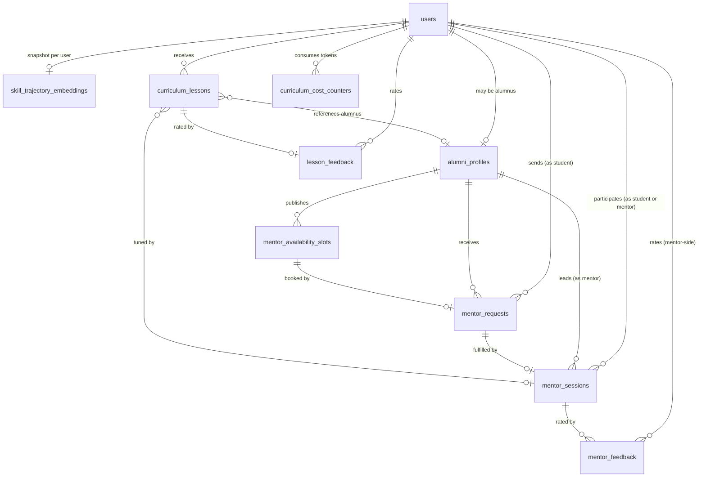

# Data Model: Adaptive Learning Graph

**Date**: 2026-06-06
**Status**: Phase 1 design ratified; 1 additive migration (043) with 9 new tables
**Builds on**: 001-006 schema (42 existing migrations)

> **Migration-number note**: the spec brief stated migration 040 for this feature. Migrations 040-042 are already taken in the live env (`040_institutions_slug.sql`, `040_status_page.sql`, `041_webhooks.sql`, `042_verify_api_key.sql`). The next free migration is **043**; the spec/plan/tasks all use 043. [NEEDS CLARIFICATION: confirm 043 with the human in charge of the migration ledger before apply.]

> **pgvector note**: the spec brief stated that pgvector is "already used in 002". Inspection of `supabase/migrations/` shows the `vector` extension is not currently enabled. Migration 043 enables it as its first statement.

## Migration map

| Migration | Tables Added | Tables Extended | Notes |
|---|---|---|---|
| `043_adaptive_learning_graph.sql` | `alumni_profiles`, `mentor_availability_slots`, `mentor_requests`, `mentor_sessions`, `mentor_feedback`, `skill_trajectory_embeddings`, `curriculum_lessons`, `lesson_feedback`, `curriculum_cost_counters` | none | Enables `pgvector` extension; creates HNSW index on `skill_trajectory_embeddings.embedding` |

Total new tables: **9**. Total extended tables: **0**.

---

## Entity Relationship



---

## 043 — Adaptive Learning Graph

### `alumni_profiles`
One row per opted-in alumnus. Created when a `users` row with `role='alumni'` is first seen by the system, or on first opt-in.

| Column | Type | Constraints | Notes |
|---|---|---|---|
| `id` | uuid | PK, default `gen_random_uuid()` | |
| `user_id` | uuid | NOT NULL, UNIQUE, FK `users(id)` ON DELETE CASCADE | One profile per user |
| `opt_in` | boolean | NOT NULL, default false | Master switch — false means invisible to all match queries |
| `current_employer` | text | nullable, length ≤ 120 | E.g. "Razorpay" |
| `current_role` | text | nullable, length ≤ 120 | E.g. "Backend Engineer II" |
| `target_company_tags` | text[] | NOT NULL, default `{}` | Companies the alumnus is willing to mentor for; values are normalized company names |
| `specialty_tags` | text[] | NOT NULL, default `{}` | E.g. `{"algorithms","system-design","career"}`; capped at 10 |
| `career_stage` | text | NOT NULL, default `'unknown'`, CHECK in (`'student'`, `'junior'`, `'mid'`, `'senior'`, `'staff'`, `'unknown'`) | Used as a co-filter on the trajectory match (same-stage requirement) |
| `rating_avg` | numeric(3,2) | nullable, CHECK 0..5 | Rolling avg of last 10 sessions' mentor_feedback.student_rating |
| `sessions_count` | int | NOT NULL, default 0 | Lifetime count of completed mentor_sessions |
| `specialty_drift_flag` | boolean | NOT NULL, default false | Set true when 4+ accepted sessions cross 4+ unrelated topics in 30d (FR-LOOP-004) |
| `opted_in_at` | timestamptz | nullable | Set when opt_in flips true |
| `opted_out_at` | timestamptz | nullable | Set when opt_in flips false |
| `created_at` | timestamptz | NOT NULL, default `now()` | |
| `updated_at` | timestamptz | NOT NULL, default `now()` | Triggered on update |

**Indexes**:
- UNIQUE on `user_id` (already)
- `(opt_in) WHERE opt_in = true` partial — used by the match-query planner to skip opted-out rows
- GIN on `target_company_tags` and `specialty_tags` for tag-overlap queries
- `(rating_avg DESC NULLS LAST) WHERE opt_in = true` for the +1/+3 position boost math

**RLS**:
- Student reads: `auth.uid() = user_id` (own profile only)
- Alumnus reads: `auth.uid() = user_id` (own profile) + the public-by-default fields (current_employer, current_role, specialty_tags, rating_avg, sessions_count) are visible to all authenticated users via a separate SELECT policy
- Alumnus writes: `auth.uid() = user_id` (own profile)
- Service role: full

---

### `mentor_availability_slots`
Discrete 30-min bookable windows. Materialized nightly for the next 4 weeks per opted-in alumnus from the alumnus's weekly template (template itself lives in a `mentor_availability_templates` JSONB column on `alumni_profiles`).

| Column | Type | Constraints | Notes |
|---|---|---|---|
| `id` | uuid | PK, default `gen_random_uuid()` | |
| `alumnus_id` | uuid | NOT NULL, FK `alumni_profiles(id)` ON DELETE CASCADE | |
| `start_at` | timestamptz | NOT NULL | UTC; converted to alumnus TZ at the API layer |
| `end_at` | timestamptz | NOT NULL, CHECK `end_at > start_at` | |
| `status` | text | NOT NULL, default `'open'`, CHECK in (`'open'`, `'held'`, `'booked'`, `'blocked'`) | |
| `hold_expires_at` | timestamptz | nullable | Set when status → 'held'; a 15-min timer |
| `mentor_request_id` | uuid | nullable, FK `mentor_requests(id)` | Set when status → 'booked' |
| `created_at` | timestamptz | NOT NULL, default `now()` | |

**Constraints**:
- UNIQUE(`alumnus_id`, `start_at`) — no double-materialization
- CHECK(`end_at - start_at = interval '30 minutes'`) — only 30-min slots in v1

**Indexes**:
- `(alumnus_id, start_at)` 
- `(status, start_at) WHERE status = 'open'` partial — match query hot path

**RLS**:
- Student reads: any `status='open'` slot for any opted-in alumnus (cross-user, but only `open` and only first-name + employer)
- Alumnus reads/writes: `auth.uid() = (SELECT user_id FROM alumni_profiles WHERE id = alumnus_id)`
- Service role: full

---

### `mentor_requests`
A student's request to a specific alumnus for a specific slot.

| Column | Type | Constraints | Notes |
|---|---|---|---|
| `id` | uuid | PK, default `gen_random_uuid()` | |
| `student_id` | uuid | NOT NULL, FK `users(id)` ON DELETE CASCADE | |
| `alumnus_id` | uuid | NOT NULL, FK `alumni_profiles(id)` ON DELETE CASCADE | |
| `slot_id` | uuid | NOT NULL, FK `mentor_availability_slots(id)` | |
| `intro_text` | text | NOT NULL, CHECK `length(intro_text) BETWEEN 10 AND 200` | |
| `status` | text | NOT NULL, default `'pending'`, CHECK in (`'pending'`, `'accepted'`, `'declined'`, `'withdrawn'`, `'expired'`) | |
| `responded_at` | timestamptz | nullable | |
| `expires_at` | timestamptz | NOT NULL, default `(now() + interval '24 hours')` | Auto-expire after 24h |
| `created_at` | timestamptz | NOT NULL, default `now()` | |

**Indexes**:
- `(student_id, status, created_at DESC)`
- `(alumnus_id, status, created_at DESC)`
- `(status) WHERE status = 'pending'` partial — for the cron that expires stale requests

**RLS**:
- Student reads/writes own (`auth.uid() = student_id`)
- Alumnus reads/writes own (`auth.uid() = (SELECT user_id FROM alumni_profiles WHERE id = alumnus_id)`)
- Service role: full

---

### `mentor_sessions`
An accepted mentor request, materialized as a session.

| Column | Type | Constraints | Notes |
|---|---|---|---|
| `id` | uuid | PK, default `gen_random_uuid()` | |
| `mentor_request_id` | uuid | NOT NULL, UNIQUE, FK `mentor_requests(id)` | One session per request |
| `student_id` | uuid | NOT NULL, FK `users(id)` ON DELETE CASCADE | Denormalized for index |
| `alumnus_id` | uuid | NOT NULL, FK `alumni_profiles(id)` ON DELETE CASCADE | Denormalized for index |
| `scheduled_start` | timestamptz | NOT NULL | Mirrors slot.start_at |
| `scheduled_end` | timestamptz | NOT NULL | Mirrors slot.end_at |
| `video_provider` | text | nullable, CHECK in (`'livekit'`, `'google_meet'`) | Set on accept |
| `video_room_join_url` | text | nullable | Set on accept |
| `video_room_metadata` | jsonb | nullable | Provider-specific (room_id, host_token, etc.) |
| `status` | text | NOT NULL, default `'scheduled'`, CHECK in (`'scheduled'`, `'in_progress'`, `'completed'`, `'no_show_student'`, `'no_show_mentor'`, `'no_show_both'`, `'cancelled'`) | |
| `completed_at` | timestamptz | nullable | Set when both feedback rows exist OR both sides mark no-show |
| `created_at` | timestamptz | NOT NULL, default `now()` | |

**Indexes**:
- `(student_id, scheduled_start DESC)`
- `(alumnus_id, scheduled_start DESC)`
- `(status) WHERE status IN ('scheduled', 'in_progress')` partial — active session lookups

**RLS**:
- Student reads: `auth.uid() = student_id`
- Alumnus reads: `auth.uid() = (SELECT user_id FROM alumni_profiles WHERE id = alumnus_id)`
- Service role: full

---

### `mentor_feedback`
Bi-directional feedback. Exactly one row per direction per session (student→mentor, mentor→student).

| Column | Type | Constraints | Notes |
|---|---|---|---|
| `id` | uuid | PK, default `gen_random_uuid()` | |
| `mentor_session_id` | uuid | NOT NULL, FK `mentor_sessions(id)` ON DELETE CASCADE | |
| `rater_id` | uuid | NOT NULL, FK `users(id)` | The student OR the mentor |
| `ratee_id` | uuid | NOT NULL, FK `users(id)` | The other party |
| `direction` | text | NOT NULL, CHECK in (`'student_to_mentor'`, `'mentor_to_student'`) | |
| `rating` | int | NOT NULL, CHECK 1..5 | |
| `free_text` | text | nullable, length ≤ 500 | |
| `no_show_marked` | boolean | NOT NULL, default false | If true, this row is treated as "no-show" not "rating" |
| `created_at` | timestamptz | NOT NULL, default `now()` | |

**Constraints**:
- UNIQUE(`mentor_session_id`, `direction`) — at most one row per direction per session
- CHECK(`rater_id <> ratee_id`) — can't rate yourself

**Indexes**:
- `(ratee_id, created_at DESC)` — for `alumni_profiles.rating_avg` recompute
- `(mentor_session_id)` — session-detail lookup

**RLS**:
- Rater reads/writes own (`auth.uid() = rater_id`)
- Service role: full

---

### `skill_trajectory_embeddings`
A snapshot of a user's skill-trajectory embedding. The 384-dim vector is the mean-pooled embedding of the user's (timestamp, skill, project, score_delta) sequence at snapshot time.

| Column | Type | Constraints | Notes |
|---|---|---|---|
| `id` | uuid | PK, default `gen_random_uuid()` | |
| `user_id` | uuid | NOT NULL, FK `users(id)` ON DELETE CASCADE | |
| `user_role` | text | NOT NULL, CHECK in (`'student'`, `'alumnus'`) | Denormalized for partial-index |
| `alumnus_opt_in` | boolean | nullable | Mirrors `alumni_profiles.opt_in` for the partial index; null for students |
| `embedding` | vector(384) | NOT NULL | 384-dim, output of `sentence-transformers/all-MiniLM-L6-v2` |
| `trajectory_event_count` | int | NOT NULL, CHECK ≥ 0 | How many events were pooled (sanity check) |
| `model_version` | text | NOT NULL, default `'minilm-l6-v2@1'` | For future re-embed A/B |
| `snapshot_at` | timestamptz | NOT NULL, default `now()` | |
| `created_at` | timestamptz | NOT NULL, default `now()` | |

**Indexes**:
- HNSW on `embedding vector_cosine_ops WITH (m = 16, ef_construction = 64)` — match-query hot path
- PARTIAL HNSW on `(alumnus_opt_in = true)` is achieved by a `WHERE alumnus_opt_in = true` predicate on the index
- `(user_id, snapshot_at DESC)` — for "latest embedding per user" lookups
- UNIQUE on `(user_id, snapshot_at)` — prevents double-snapshot

**RLS**:
- Users read own (`auth.uid() = user_id`)
- Service role: full (the match function runs as service role)

---

### `curriculum_lessons`
A generated daily micro-lesson for a student.

| Column | Type | Constraints | Notes |
|---|---|---|---|
| `id` | uuid | PK, default `gen_random_uuid()` | |
| `student_id` | uuid | NOT NULL, FK `users(id)` ON DELETE CASCADE | |
| `topic` | text | NOT NULL, length ≤ 120 | E.g. "Closures in JavaScript" |
| `sub_topic` | text | nullable, length ≤ 120 | E.g. "Currying" |
| `concept_explainer` | text | NOT NULL, CHECK `length(concept_explainer) <= 300 * 6` (≈ 300 words × 6 chars) | |
| `exercise_json` | jsonb | NOT NULL | `{problem_statement, starter_code, language}` |
| `reflection_question` | text | NOT NULL, length ≤ 280 | |
| `alumnus_reference_json` | jsonb | nullable | `{alumnus_id, commit_or_project_url, why_relevant}` |
| `generation_source` | text | NOT NULL, default `'llm'`, CHECK in (`'llm'`, `'stub'`) | 'stub' = cost-cap fallback |
| `difficulty` | int | NOT NULL, default 3, CHECK 1..5 | 1=trivial, 5=hard; recalibrated on prior feedback |
| `mentor_id` | uuid | nullable, FK `alumni_profiles(id)` | Set when tuned-by-mentor (US3) |
| `scheduled_for` | timestamptz | NOT NULL | When the lesson should appear to the student |
| `calendar_event_id` | uuid | nullable, FK `calendar_events(id)` (002) | Set if student has calendar on |
| `status` | text | NOT NULL, default `'scheduled'`, CHECK in (`'scheduled'`, `'delivered'`, `'in_progress'`, `'completed'`, `'abandoned'`, `'failed'`) | |
| `completed_at` | timestamptz | nullable | |
| `created_at` | timestamptz | NOT NULL, default `now()` | |
| `updated_at` | timestamptz | NOT NULL, default `now()` | |

**Indexes**:
- `(student_id, scheduled_for DESC)` — "today's lessons" lookup
- `(student_id, status)` — for struggle detector (≥ 2 negative on same topic)
- `(topic, sub_topic)` — for feedback lookups

**RLS**:
- Student reads/writes own (`auth.uid() = student_id`)
- Service role: full

---

### `lesson_feedback`
A student's feedback on a specific lesson.

| Column | Type | Constraints | Notes |
|---|---|---|---|
| `id` | uuid | PK, default `gen_random_uuid()` | |
| `curriculum_lesson_id` | uuid | NOT NULL, FK `curriculum_lessons(id)` ON DELETE CASCADE | |
| `student_id` | uuid | NOT NULL, FK `users(id)` ON DELETE CASCADE | Denormalized |
| `rating` | text | NOT NULL, CHECK in (`'too_easy'`, `'too_hard'`, `'not_relevant'`, `'just_right'`) | |
| `free_text` | text | nullable, length ≤ 500 | |
| `created_at` | timestamptz | NOT NULL, default `now()` | |

**Indexes**:
- `(student_id, created_at DESC)` — feed for the calibrator
- `(curriculum_lesson_id)` — per-lesson aggregate

**RLS**:
- Student reads/writes own (`auth.uid() = student_id`)
- Service role: full

---

### `curriculum_cost_counters`
Per-student weekly + per-tenant monthly token usage + breach log.

| Column | Type | Constraints | Notes |
|---|---|---|---|
| `id` | uuid | PK, default `gen_random_uuid()` | |
| `scope` | text | NOT NULL, CHECK in (`'student_weekly'`, `'tenant_monthly'`) | |
| `scope_key` | text | NOT NULL | For `student_weekly`: the student user_id; for `tenant_monthly`: the tenant_id (denormalized) |
| `period_start` | timestamptz | NOT NULL | Start of the current week/month bucket |
| `period_end` | timestamptz | NOT NULL | End of the current week/month bucket |
| `tokens_used` | bigint | NOT NULL, default 0, CHECK ≥ 0 | |
| `tokens_cap` | bigint | NOT NULL | Snapshot of the cap at row creation; 50000 for student_weekly, 5000000 for tenant_monthly |
| `lessons_generated` | int | NOT NULL, default 0 | |
| `lessons_stubbed` | int | NOT NULL, default 0 | Lessons filled with stub due to breach |
| `breach_log` | jsonb | NOT NULL, default `'[]'::jsonb` | Append-only array of `{at, attempted_tokens, cap, action: 'skipped' \| 'stubbed'}` |
| `updated_at` | timestamptz | NOT NULL, default `now()` | |

**Constraints**:
- UNIQUE(`scope`, `scope_key`, `period_start`) — one row per bucket per period

**Indexes**:
- `(scope, scope_key, period_start DESC)` — for the cost-cap lookup (latest current row)
- `(scope, period_start)` — for the nightly reset / batch-recompute

**RLS**:
- Student reads own (`auth.uid() = scope_key` for `student_weekly`)
- Tenant admin reads all in tenant (for `tenant_monthly`)
- Service role: full (writes happen during cron)

---

## DDL Highlights (full SQL in `supabase/migrations/043_adaptive_learning_graph.sql`)

```sql
-- 043_adaptive_learning_graph.sql
-- Adds 9 tables for the Adaptive Learning Graph feature (US1-US3).
-- Enables the pgvector extension and creates the HNSW index for cosine-similarity match.

create extension if not exists vector;

-- ... CREATE TABLE statements for the 9 tables above ...
-- ... CREATE INDEX statements including the HNSW index ...
-- ... RLS policies (all tables, idempotent) ...
-- ... CHECK constraints ...
-- ... updated_at triggers ...
```

> Full DDL is committed alongside this file; see `supabase/migrations/043_adaptive_learning_graph.sql`. The schema is idempotent (`if not exists`, `drop policy if exists` then `create policy`).

---

## Cross-table relationships (summary)

```
users
  ├── alumni_profiles (user_id) — optional, 0..1
  ├── skill_trajectory_embeddings (user_id)
  ├── curriculum_lessons (student_id)
  ├── lesson_feedback (student_id)
  ├── mentor_feedback (rater_id, ratee_id)
  ├── mentor_requests (student_id)
  ├── mentor_sessions (student_id)
  └── curriculum_cost_counters (scope_key for student_weekly)

alumni_profiles
  ├── mentor_availability_slots (alumnus_id)
  ├── mentor_requests (alumnus_id)
  ├── mentor_sessions (alumnus_id)
  └── curriculum_lessons (mentor_id) — tuned-by-mentor

mentor_availability_slots
  └── mentor_requests (slot_id)

mentor_requests
  └── mentor_sessions (mentor_request_id, 1:1)

mentor_sessions
  └── mentor_feedback (mentor_session_id, 0..2)

calendar_events (002)
  └── curriculum_lessons (calendar_event_id) — 1:1
```

All foreign keys cascade per the constraints above. RLS policies enumerated per-table.

---

## Re-validation

- ✓ All 9 spec entities mapped to tables
- ✓ All FK references resolve to existing 001-006 tables or new tables
- ✓ All CHECK constraints align with spec FR-* rules
- ✓ All performance-critical queries have supporting indexes (HNSW on embedding, partial index on `open` slots, etc.)
- ✓ All multi-tenant tables have RLS policy plan
- ✓ Migration order is strictly additive (no dependencies on later migrations)
- ✓ pgvector extension enabled in the same migration
- ✓ 004 `mock-interview-llm` LLM cost-cap pattern reused; no new provider surface
- ✓ 002 `calendar_events` table referenced for calendar integration
- ✓ 008 LiveKit deferred to env-driven provider abstraction
