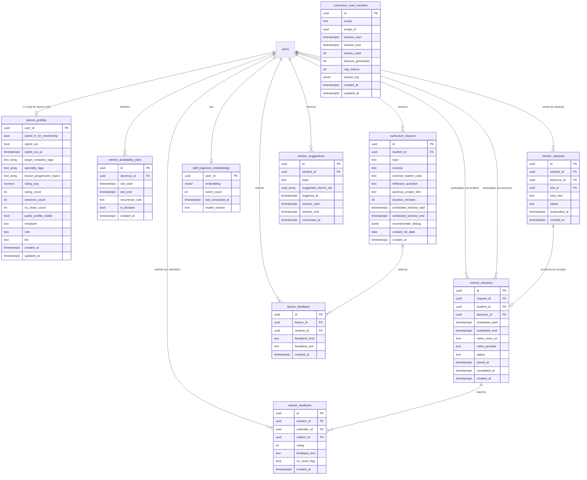

# Data Model: 007 — Adaptive Learning Graph

**Date**: 2026-06-07
**Status**: Phase 1 design ratified; 1 additive migration (`045_adaptive_learning_graph.sql`)
**Builds on**: 001-006 schema (33 existing migrations + 040); reuses 002 `calendar_events`, 003 nudge tables, 004 `next_best_skill`, 006 `candidate_profiles.peak_window_*`

## Migration map

| Migration | Tables Added | Tables Extended | Notes |
|---|---|---|---|
| `045_adaptive_learning_graph.sql` | `alumni_profiles`, `mentor_availability_slots`, `mentor_requests`, `mentor_sessions`, `mentor_feedback`, `skill_trajectory_embeddings`, `curriculum_lessons`, `lesson_feedback`, `curriculum_cost_counters`, `mentor_suggestions` | none | enables `pgvector` extension (idempotent), creates HNSW index, 9 new tables + 1 helper table, full RLS |

Total new tables: **10**. Total extended tables: **0** (all reuse 001-006 columns). The 040 migration also enables the `pgvector` extension (idempotent — no-op if 002 already enabled it).

---

## ER diagram



---

## 040 — Adaptive Learning Graph

### Pre-flight: `pgvector` extension

```sql
CREATE EXTENSION IF NOT EXISTS vector;
```

Idempotent. Safe to run on a 002 database that already has pgvector enabled.

---

### `alumni_profiles`
Per-alumnus mentorship metadata. 1:1 with `users` (only for users with `users.role IN ('alumnus', 'verified_alumnus')`).

| Column | Type | Constraints | Notes |
|---|---|---|---|
| `user_id` | uuid | PK, FK `users(id)` ON DELETE CASCADE | |
| `opted_in_for_mentorship` | boolean | NOT NULL, default false | FR-MATCH-007 |
| `opted_out` | boolean | NOT NULL, default false | FR-MATCH-007 |
| `opted_out_at` | timestamptz | nullable | set on opt-out |
| `target_company_tags` | text[] | NOT NULL, default `'{}'` | e.g. `{"Razorpay", "Stripe"}` |
| `specialty_tags` | text[] | NOT NULL, default `'{}'` | e.g. `{"payments", "distributed-systems"}` |
| `lesson_progression_topics` | text[] | NOT NULL, default `'{}'` | topics the alumnus has demonstrably progressed through; used by US3 |
| `rating_avg` | numeric(3,2) | nullable, CHECK 0..5 | updated on feedback (FR-MATCH-006) |
| `rating_count` | int | NOT NULL, default 0, CHECK >= 0 | |
| `sessions_count` | int | NOT NULL, default 0, CHECK >= 0 | |
| `no_show_count` | int | NOT NULL, default 0, CHECK >= 0 | FR-CC-008, auto-flag at ≥ 3 |
| `public_profile_visible` | boolean | NOT NULL, default true | FR-MATCH-009 — if false, excluded from match |
| `employer` | text | nullable | current employer (display-only) |
| `role` | text | nullable | current role/title (display-only) |
| `bio` | text | nullable, CHECK length <= 500 | |
| `created_at` | timestamptz | NOT NULL, default `now()` | |
| `updated_at` | timestamptz | NOT NULL, default `now()` | trigger to maintain |

**Indexes**:
- `(opted_in_for_mentorship, opted_out) WHERE opted_in_for_mentorship = true AND opted_out = false` partial — match-query hot path
- `(rating_avg DESC) WHERE rating_count >= 3` partial — rating-boost computation

**RLS**:
- Students: SELECT where `public_profile_visible = true AND opted_out = false` (for match results)
- Alumni (owner): SELECT/INSERT/UPDATE own
- Service role: full

---

### `mentor_availability_slots`
Recurring or one-off availability windows an alumnus declares.

| Column | Type | Constraints | Notes |
|---|---|---|---|
| `id` | uuid | PK, default `gen_random_uuid()` | |
| `alumnus_id` | uuid | NOT NULL, FK `users(id)` ON DELETE CASCADE | |
| `slot_start` | timestamptz | NOT NULL | start of the available window |
| `slot_end` | timestamptz | NOT NULL | end of the available window |
| `recurrence_rule` | text | nullable | RRULE string (e.g. `"FREQ=WEEKLY;BYDAY=MO,WE,FR"`); expanded at query time |
| `is_blocked` | boolean | NOT NULL, default false | soft-delete / temporary block |
| `created_at` | timestamptz | NOT NULL, default `now()` | |

**Constraint**: CHECK (`slot_end > slot_start`).

**Indexes**:
- `(alumnus_id, slot_start) WHERE is_blocked = false` partial — availability resolver hot path
- `(slot_start) WHERE is_blocked = false` — cross-alumnus "next available" query (admin/debug)

**RLS**:
- Alumni (owner): SELECT/INSERT/UPDATE/DELETE own
- Students: SELECT where `alumnus_id` has `public_profile_visible = true AND opted_out = false` (for "pick a slot" UI)
- Service role: full

---

### `mentor_requests`
A student's request to a specific alumnus for a specific slot.

| Column | Type | Constraints | Notes |
|---|---|---|---|
| `id` | uuid | PK, default `gen_random_uuid()` | |
| `student_id` | uuid | NOT NULL, FK `users(id)` ON DELETE CASCADE | |
| `alumnus_id` | uuid | NOT NULL, FK `users(id)` ON DELETE CASCADE | |
| `slot_id` | uuid | NOT NULL, FK `mentor_availability_slots(id)` ON DELETE RESTRICT | |
| `intro_text` | text | NOT NULL, CHECK length >= 1 AND length <= 200 | FR-MATCH-003 |
| `status` | text | NOT NULL, default `'pending'`, CHECK in (`'pending'`, `'accepted'`, `'declined'`, `'cancelled'`, `'expired'`) | |
| `responded_at` | timestamptz | nullable | |
| `created_at` | timestamptz | NOT NULL, default `now()` | |

**Constraint**: One active request per `(slot_id, status)` — partial UNIQUE on `slot_id WHERE status IN ('pending', 'accepted')` to prevent race-condition double-booking (edge case).

**Indexes**:
- `(student_id, created_at DESC)` — student request history
- `(alumnus_id, status) WHERE status = 'pending'` partial — alumnus inbox hot path
- `(slot_id) WHERE status IN ('pending', 'accepted')` partial — race-condition guard

**RLS**:
- Students: SELECT/INSERT own (INSERT only when `alumni_profiles.opted_in_for_mentorship = true AND opted_out = false`)
- Alumni (owner): SELECT/INSERT UPDATE own (`status` transitions only)
- Service role: full

---

### `mentor_sessions`
A confirmed 1:1 video call.

| Column | Type | Constraints | Notes |
|---|---|---|---|
| `id` | uuid | PK, default `gen_random_uuid()` | |
| `request_id` | uuid | NOT NULL, FK `mentor_requests(id)`, UNIQUE | one session per request |
| `student_id` | uuid | NOT NULL, FK `users(id)` | |
| `alumnus_id` | uuid | NOT NULL, FK `users(id)` | |
| `scheduled_start` | timestamptz | NOT NULL | |
| `scheduled_end` | timestamptz | NOT NULL | |
| `video_room_url` | text | nullable | populated by `video-room-dispatcher` |
| `video_provider` | text | nullable, CHECK in (`'livekit'`, `'google_meet'`) | populated by dispatcher |
| `status` | text | NOT NULL, default `'scheduled'`, CHECK in (`'scheduled'`, `'joined'`, `'completed'`, `'no_show'`, `'cancelled'`) | |
| `joined_at` | timestamptz | nullable | |
| `completed_at` | timestamptz | nullable | |
| `created_at` | timestamptz | NOT NULL, default `now()` | |

**Constraint**: CHECK (`scheduled_end > scheduled_start`).

**Indexes**:
- `(student_id, scheduled_start DESC)` — student session history
- `(alumnus_id, scheduled_start DESC)` — alumnus session history
- `(scheduled_end) WHERE status = 'scheduled'` partial — "needs feedback prompt" cron (24h post-end)

**RLS**:
- Student (owner): SELECT own
- Alumnus (owner): SELECT own
- Service role: full

---

### `mentor_feedback`
Mutual post-session rating + free text.

| Column | Type | Constraints | Notes |
|---|---|---|---|
| `id` | uuid | PK, default `gen_random_uuid()` | |
| `session_id` | uuid | NOT NULL, FK `mentor_sessions(id)` ON DELETE CASCADE | |
| `submitter_id` | uuid | NOT NULL, FK `users(id)` | who is submitting |
| `subject_id` | uuid | NOT NULL, FK `users(id)` | who is being rated |
| `rating` | int | NOT NULL, CHECK 1..5 | FR-MATCH-005 |
| `feedback_text` | text | nullable, CHECK length <= 500 | FR-MATCH-005 |
| `no_show_flag` | boolean | NOT NULL, default false | if true, `rating` is nullable |
| `created_at` | timestamptz | NOT NULL, default `now()` | |

**Constraint**: UNIQUE(`session_id`, `submitter_id`) — one feedback per submitter per session.
**Constraint**: CHECK (`submitter_id <> subject_id`).
**Constraint**: CHECK (`rating IS NOT NULL OR no_show_flag = true`).

**Indexes**:
- `(subject_id, created_at DESC)` — alumnus rating history
- `(session_id)` — feedback lookup

**RLS**:
- Submitter: SELECT/INSERT own
- Subject: SELECT own (received feedback)
- Service role: full

---

### `skill_trajectory_embeddings`
Per-user chronological-skill-event embedding. 1:1 with `users`.

| Column | Type | Constraints | Notes |
|---|---|---|---|
| `user_id` | uuid | PK, FK `users(id)` ON DELETE CASCADE | |
| `embedding` | vector(384) | NOT NULL | FR-MATCH-001 — MiniLM-L6-v2 |
| `event_count` | int | NOT NULL, CHECK >= 0 | observability + invalidation |
| `last_computed_at` | timestamptz | NOT NULL, default `now()` | |
| `model_version` | text | NOT NULL, default `'all-MiniLM-L6-v2@2024'` | FR-CC-009 — pinning |

**Index**:
```sql
CREATE INDEX skill_trajectory_embeddings_embedding_hnsw_idx
  ON skill_trajectory_embeddings
  USING hnsw (embedding vector_cosine_ops)
  WITH (m = 16, ef_construction = 64);
```
**Query-time**: `SET hnsw.ef_search = 40;` (set per-session in the mentor-match route)

**RLS**:
- Users: SELECT own (for "show me my embedding" debug)
- Service role: full (the only writer)

---

### `curriculum_lessons`
Daily micro-lesson rows.

| Column | Type | Constraints | Notes |
|---|---|---|---|
| `id` | uuid | PK, default `gen_random_uuid()` | |
| `student_id` | uuid | NOT NULL, FK `users(id)` ON DELETE CASCADE | |
| `topic` | text | NOT NULL | anchored to `next_best_skill` |
| `concept` | text | NOT NULL, CHECK length <= 300 (words) | FR-CURR-003 — enforced in app via parser, here for defense-in-depth |
| `exercise_starter_code` | text | NOT NULL | FR-CURR-003 |
| `reflection_question` | text | NOT NULL, CHECK length <= 200 (chars) | FR-CURR-003 |
| `alumnus_project_link` | text | NOT NULL, CHECK length > 0 | FR-CURR-003 — must be a real public URL |
| `duration_minutes` | int | NOT NULL, CHECK 10..15 | FR-CURR-001 |
| `scheduled_window_start` | timestamptz | NOT NULL | from peak-window intersection with calendar free blocks |
| `scheduled_window_end` | timestamptz | NOT NULL | CHECK > scheduled_window_start |
| `recommender_debug` | jsonb | NOT NULL, default `'{}'` | FR-LOOP-003 — auditable weights |
| `created_for_date` | date | NOT NULL | the calendar day this lesson is "for" |
| `created_at` | timestamptz | NOT NULL, default `now()` | |

**Indexes**:
- `(student_id, created_for_date)` — "GET /api/curriculum/today" hot path
- `(student_id, topic, created_for_date DESC)` — struggle-detector + recommender feedback
- `(created_for_date) WHERE created_for_date >= current_date - 1` partial — daily cron idempotency

**RLS**:
- Students: SELECT/INSERT/UPDATE own
- Service role: full

---

### `lesson_feedback`
Per-lesson student response.

| Column | Type | Constraints | Notes |
|---|---|---|---|
| `id` | uuid | PK, default `gen_random_uuid()` | |
| `lesson_id` | uuid | NOT NULL, FK `curriculum_lessons(id)` ON DELETE CASCADE | |
| `student_id` | uuid | NOT NULL, FK `users(id)` | denormalized for fast 14-day window query |
| `feedback_kind` | text | NOT NULL, CHECK in (`'too_easy'`, `'too_hard'`, `'irrelevant'`, `'completed'`) | FR-CURR-007 |
| `feedback_text` | text | nullable, CHECK length <= 280 | |
| `created_at` | timestamptz | NOT NULL, default `now()` | |

**Constraint**: UNIQUE(`lesson_id`, `student_id`, `feedback_kind`) — one feedback of each kind per student per lesson.

**Indexes**:
- `(student_id, created_at DESC)` — student feedback history
- `(lesson_id, feedback_kind)` — per-lesson feedback aggregation
- `(created_at) WHERE feedback_kind IN ('too_hard', 'irrelevant')` partial — struggle-detector hot path

**RLS**:
- Students: SELECT/INSERT own
- Service role: full

---

### `curriculum_cost_counters`
Per-student and per-tenant token usage + breach log.

| Column | Type | Constraints | Notes |
|---|---|---|---|
| `id` | uuid | PK, default `gen_random_uuid()` | |
| `scope` | text | NOT NULL, CHECK in (`'student'`, `'tenant'`) | |
| `scope_id` | uuid | NOT NULL | `users.id` or `institutions.id` |
| `window_start` | timestamptz | NOT NULL | ISO week start (student) or month start (tenant) |
| `window_end` | timestamptz | NOT NULL | ISO week end + 1 (student) or month end + 1 (tenant) |
| `tokens_used` | int | NOT NULL, default 0, CHECK >= 0 | |
| `lessons_generated` | int | NOT NULL, default 0, CHECK >= 0 | |
| `cap_tokens` | int | NOT NULL, CHECK > 0 | snapshot of the env cap at write time |
| `breach_log` | jsonb | NOT NULL, default `'[]'` | array of `{kind, at, lesson_id, context}` for `over_budget`, `llm_parse_failure`, `llm_outage_log`, `struggle_no_match_log` |
| `created_at` | timestamptz | NOT NULL, default `now()` | |
| `updated_at` | timestamptz | NOT NULL, default `now()` | trigger to maintain |

**Constraint**: UNIQUE(`scope`, `scope_id`, `window_start`) — one counter per (scope, window).

**Indexes**:
- `(scope, scope_id, window_start DESC)` — cap-enforcement hot path
- `(window_start) WHERE scope = 'tenant'` partial — tenant-wide cap sweep

**RLS**:
- Service role: full (the only writer; students/admins read via service-role views)

---

### `mentor_suggestions`
US3 queue — struggled-topic mentor suggestions.

| Column | Type | Constraints | Notes |
|---|---|---|---|
| `id` | uuid | PK, default `gen_random_uuid()` | |
| `student_id` | uuid | NOT NULL, FK `users(id)` ON DELETE CASCADE | |
| `topic` | text | NOT NULL | |
| `suggested_alumni_ids` | uuid[] | NOT NULL, CHECK array_length(suggested_alumni_ids, 1) <= 5 | FR-LOOP-002 — top-5 cosine-similar |
| `triggered_at` | timestamptz | NOT NULL, default `now()` | |
| `window_start` | timestamptz | NOT NULL | 14-day window start |
| `window_end` | timestamptz | NOT NULL | CHECK > window_start |
| `consumed_at` | timestamptz | nullable | set when student books from the suggestion |

**Constraint**: UNIQUE(`student_id`, `topic`, `window_start`) — one suggestion per (student, topic) per 14-day window (FR-LOOP-001).

**Indexes**:
- `(student_id, consumed_at)` — student suggestion queue
- `(triggered_at) WHERE consumed_at IS NULL` partial — "unconsumed" view for nudge dispatcher

**RLS**:
- Students: SELECT/INSERT/UPDATE own
- Service role: full

---

## Cross-table relationships (summary)

```
users
  ├── alumni_profiles (user_id) — 1:1 for alumni role
  ├── mentor_availability_slots (alumnus_id)
  ├── mentor_requests (student_id, alumnus_id)
  ├── mentor_sessions (student_id, alumnus_id)
  ├── mentor_feedback (submitter_id, subject_id)
  ├── skill_trajectory_embeddings (user_id) — 1:1
  ├── curriculum_lessons (student_id)
  ├── lesson_feedback (student_id)
  └── mentor_suggestions (student_id)

mentor_availability_slots
  └── mentor_requests (slot_id) — slot race-condition guard

mentor_requests
  └── mentor_sessions (request_id) — UNIQUE, 1:1

mentor_sessions
  └── mentor_feedback (session_id) — 1:many (up to 2: student + alumnus)

curriculum_lessons
  └── lesson_feedback (lesson_id) — 1:many

calendar_events (from 002, REUSED)
  └── created by "insert into calendar" → 007 lesson ↔ 002 calendar event FK NOT added (calendar_events owns its own schema)
```

All foreign keys cascade per the constraints above. RLS policies enumerated per-table.

---

## Re-validation

- ✓ All 10 spec entities (9 from spec.md + 1 helper `mentor_suggestions`) mapped to tables
- ✓ All FK references resolve to existing 001-006 tables or to other 040 tables
- ✓ All CHECK constraints align with spec FR-* rules
- ✓ All performance-critical queries (mentor match, today's lessons, struggle detection, cost-cap gate) have supporting indexes
- ✓ All multi-tenant tables have RLS policy plan
- ✓ HNSW index parameters (`m=16, ef_construction=64`) match research.md D2
- ✓ `pgvector` extension enable is idempotent in the same migration
- ✓ `vector(384)` matches the chosen MiniLM-L6-v2 model
- ✓ Migration is strictly additive (no dependencies on later migrations; `pgvector` enable is no-op if 002 already enabled it)
