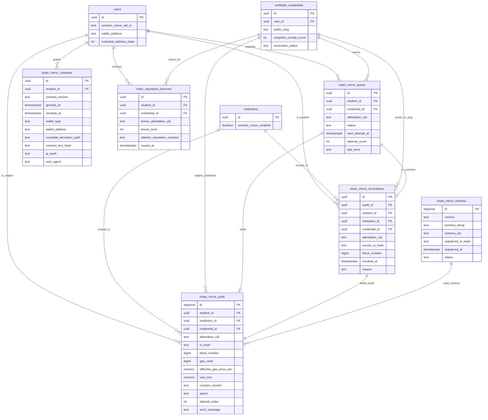

# Data Model: 009 — On-Chain Mirror (EAS on Base L2)

**Date**: 2026-06-07
**Status**: Phase 1 design ratified; 1 additive migration (042) + 1 cron migration (043)
**Builds on**: 001-007 schema (42 existing migrations)
**Note on numbering**: The user reserved migration number `042` for this feature. At the time of writing, `049_verify_api_key.sql` exists. **The SQL file for this feature is therefore written as `049_onchain_mirror.sql` per the user request, and is applied *after* `049_verify_api_key.sql`.** If the project applies migrations strictly by name order, the file should be renamed to the next free slot (e.g. `043_onchain_mirror.sql`) and the cron file renumbered to `050_cron_009.sql` — the spec/plan/tasks content is unchanged. The data-model *content* (5 tables, 2 column additions, RLS) is the contract.

## Migration map

| Migration | Tables Added | Tables Extended | Notes |
|---|---|---|---|
| `049_onchain_mirror.sql` | `chain_mirror_audit`, `chain_mirror_queue`, `chain_mirror_consents`, `chain_mirror_revocations`, `chain_reputation_bonuses`, `chain_mirror_schema` | `users` (+`onchain_mirror_opt_in`, +`wallet_address`, +`custodial_address_index`), `institutions` (+`onchain_mirror_enabled`) | 6 new tables; 5 + 1 helper (schema) for ops |
| `050_cron_009.sql` | (none) | (none) — registers 2 cron jobs on existing `pg_cron` extension | mirror-dispatcher every 5 min; unmirror-dispatcher every 15 min |

Total new tables: **6** (5 user-facing + 1 ops helper). Total extended tables: **2** (users + institutions).

---

## 0. ER diagram



---

## 042 — On-Chain Mirror (EAS on Base L2)

### `chain_mirror_audit`
Immutable log of every mirror-related action. One row per action; append-only.

| Column | Type | Constraints | Notes |
|---|---|---|---|
| `id` | bigserial | PK |  |
| `student_id` | uuid | NOT NULL, FK `users(id)` ON DELETE RESTRICT | Never delete a student with audit rows |
| `institution_id` | uuid | nullable, FK `institutions(id)` ON DELETE SET NULL | Tenant scope; nullable for system actions |
| `credential_id` | uuid | nullable, FK `verifiable_credentials(id)` ON DELETE SET NULL | The 002 VC being mirrored; nullable for system actions |
| `attestation_uid` | text | nullable | EAS `bytes32` hex string (`0xabc...`); nullable until tx is confirmed |
| `tx_hash` | text | nullable | Base L2 transaction hash |
| `block_number` | bigint | nullable |  |
| `gas_used` | bigint | nullable |  |
| `effective_gas_price_wei` | numeric(38,0) | nullable |  |
| `usd_cost` | numeric(10,6) | nullable | Computed at action time from gas oracle |
| `consent_version` | text | nullable | e.g. `'v1.0'`; from `chain_mirror_consents.consent_version` or `chain_mirror_consent_policy.version` |
| `action` | text | NOT NULL, CHECK in (`'mirror'`, `'unmirror'`, `'bulk_unmirror'`, `'consent_granted'`, `'consent_revoked'`, `'denied_tenant_disabled'`, `'denied_kill_switch'`, `'resolution_failed'`, `'kill_switch_engaged'`, `'unmirror_post_deletion'`, `'schema_registered'`, `'reputation_bonus_issued'`) |  |
| `attempt_index` | int | NOT NULL, default 1 | 1-based; mirrors retry with attempt 1..5 |
| `error_message` | text | nullable | Populated on failure |
| `created_at` | timestamptz | NOT NULL, default `now()` |  |

**Indexes**:
- `(student_id, created_at DESC)`
- `(credential_id, created_at DESC)`
- `(institution_id, created_at DESC)`
- `(attestation_uid)` partial WHERE `attestation_uid IS NOT NULL`
- `(action, created_at DESC)`

**RLS**: student sees own (`auth.uid() = student_id`); service role full; read-only for the audit admin role.

### `chain_mirror_queue`
The per-mirror work queue. One row per requested mirror.

| Column | Type | Constraints | Notes |
|---|---|---|---|
| `id` | uuid | PK, default `gen_random_uuid()` |  |
| `student_id` | uuid | NOT NULL, FK `users(id)` ON DELETE CASCADE |  |
| `credential_id` | uuid | NOT NULL, FK `verifiable_credentials(id)` ON DELETE CASCADE |  |
| `attestation_uid` | text | nullable | Set when `status='confirmed'` |
| `status` | text | NOT NULL, default `'pending'`, CHECK in (`'pending'`, `'submitted'`, `'confirmed'`, `'failed'`, `'cancelled'`, `'dead_letter'`) |  |
| `next_attempt_at` | timestamptz | NOT NULL, default `now()` | Cron dispatches rows with `next_attempt_at <= now()` |
| `attempt_count` | int | NOT NULL, default 0 | Incremented on each dispatcher pickup |
| `max_attempts` | int | NOT NULL, default 5 |  |
| `last_error` | text | nullable |  |
| `created_at` | timestamptz | NOT NULL, default `now()` |  |
| `confirmed_at` | timestamptz | nullable |  |

**Indexes**:
- `(status, next_attempt_at)` partial WHERE `status IN ('pending', 'failed')` — the dispatcher's hot path
- `(student_id, status)`
- `(credential_id)` UNIQUE partial WHERE `status IN ('pending', 'submitted')` — prevent duplicate in-flight mirrors for the same VC

**RLS**: student sees own; service role full.

### `chain_mirror_consents`
The per-student, versioned consent grant.

| Column | Type | Constraints | Notes |
|---|---|---|---|
| `id` | uuid | PK, default `gen_random_uuid()` |  |
| `student_id` | uuid | NOT NULL, FK `users(id)` ON DELETE CASCADE |  |
| `consent_version` | text | NOT NULL | e.g. `'v1.0'`, `'v1.1'`; references `chain_mirror_consent_policy.version` |
| `granted_at` | timestamptz | NOT NULL, default `now()` |  |
| `revoked_at` | timestamptz | nullable |  |
| `wallet_type` | text | NOT NULL, CHECK in (`'self_custody'`, `'platform_custodial'`) |  |
| `wallet_address` | text | NOT NULL | The EOA address (lowercase, `0x...`); for self-custody, verified via SIWE |
| `custodial_derivation_path` | text | nullable | e.g. `m/44'/60'/0'/0/123`; populated only for `wallet_type='platform_custodial'` |
| `consent_text_hash` | text | NOT NULL | keccak256 of the rendered consent text shown to the student at grant time |
| `ip_hash` | text | NOT NULL | keccak256 of the IP (we hash for DPDP minimization; the original IP is logged separately to invoke_log for fraud detection but not stored in the consent row) |
| `user_agent` | text | NOT NULL, length ≤ 512 |  |

**Indexes**:
- `(student_id, granted_at DESC)` partial WHERE `revoked_at IS NULL` — find active consent quickly
- `(student_id, consent_version)` — version-specific lookups

**RLS**: student sees own; service role full; admin role can read all (for audit).

### `chain_mirror_revocations`
The tombstone of every unmirror. Links the 002 VC to the EAS attestation at the moment of revocation.

| Column | Type | Constraints | Notes |
|---|---|---|---|
| `id` | uuid | PK, default `gen_random_uuid()` |  |
| `audit_id` | bigint | NOT NULL, FK `chain_mirror_audit(id)` ON DELETE RESTRICT | The corresponding audit row |
| `student_id` | uuid | NOT NULL, FK `users(id)` ON DELETE CASCADE |  |
| `institution_id` | uuid | nullable, FK `institutions(id)` ON DELETE SET NULL |  |
| `credential_id` | uuid | NOT NULL, FK `verifiable_credentials(id)` ON DELETE CASCADE |  |
| `attestation_uid` | text | NOT NULL | The EAS attestation being revoked |
| `revoke_tx_hash` | text | NOT NULL |  |
| `block_number` | bigint | NOT NULL |  |
| `revoked_at` | timestamptz | NOT NULL, default `now()` |  |
| `reason` | text | NOT NULL, CHECK in (`'user_request'`, `'deletion'`, `'tenant_disabled'`, `'kill_switch'`, `'dead_letter'`) |  |

**Indexes**:
- `(student_id, revoked_at DESC)`
- `(credential_id)`
- `(attestation_uid)` UNIQUE — one revocation per attestation (idempotent)

**RLS**: student sees own; service role full.

### `chain_reputation_bonuses`
The optional 1-claim reputation bonus issued for high-credibility VCs.

| Column | Type | Constraints | Notes |
|---|---|---|---|
| `id` | uuid | PK, default `gen_random_uuid()` |  |
| `student_id` | uuid | NOT NULL, FK `users(id)` ON DELETE CASCADE |  |
| `credential_id` | uuid | NOT NULL, FK `verifiable_credentials(id)` ON DELETE CASCADE |  |
| `bonus_attestation_uid` | text | NOT NULL, UNIQUE | The second EAS attestation (different schema) |
| `bonus_level` | int | NOT NULL, default 1, CHECK = 1 | Always 1 in v1 |
| `attester_reputation_contract` | text | NOT NULL | EAS `attesterReputation` contract address on Base L2 |
| `issued_at` | timestamptz | NOT NULL, default `now()` |  |

**Indexes**:
- `(student_id, issued_at DESC)`
- `(credential_id)` UNIQUE — one bonus per VC

**RLS**: student sees own; service role full.

### `chain_mirror_schema`
The registered EAS schema on Base L2. Ops/admin table for tracking schema versions.

| Column | Type | Constraints | Notes |
|---|---|---|---|
| `id` | bigserial | PK |  |
| `version` | text | NOT NULL, UNIQUE | e.g. `'v1'`, `'v2'` |
| `schema_string` | text | NOT NULL | e.g. `'bytes32 vcHash,string revocationPointer,uint64 scoreSnapshot'` |
| `schema_uid` | text | NOT NULL, UNIQUE | The bytes32 hex string returned by EAS SchemaRegistry |
| `registered_tx_hash` | text | NOT NULL |  |
| `registered_at` | timestamptz | NOT NULL, default `now()` |  |
| `status` | text | NOT NULL, default `'active'`, CHECK in (`'active'`, `'superseded'`, `'replaced'`) |  |
| `registered_by` | uuid | nullable, FK `users(id)` | The ops engineer who registered it |

**Indexes**:
- `(status)` partial WHERE `status='active'`
- `(version)` UNIQUE

**RLS**: read-only for all authenticated; insert via service role only.

### Extensions

```sql
-- 049_onchain_mirror.sql — column extensions

ALTER TABLE users
  ADD COLUMN onchain_mirror_opt_in boolean NOT NULL DEFAULT false,
  ADD COLUMN wallet_address text,
  ADD COLUMN custodial_address_index int;

ALTER TABLE users
  ADD CONSTRAINT users_wallet_address_chk
    CHECK (wallet_address IS NULL OR wallet_address ~ '^0x[a-fA-F0-9]{40}$');

ALTER TABLE users
  ADD CONSTRAINT users_custodial_address_chk
    CHECK (
      (wallet_address IS NULL AND custodial_address_index IS NULL)
      OR
      (wallet_address IS NOT NULL AND custodial_address_index IS NOT NULL AND custodial_address_index >= 0)
    );

CREATE INDEX users_onchain_mirror_opt_in_idx ON users(onchain_mirror_opt_in) WHERE onchain_mirror_opt_in = true;

ALTER TABLE institutions
  ADD COLUMN onchain_mirror_enabled boolean NOT NULL DEFAULT true;
```

### Consent policy reference (read-only)

The `chain_mirror_consent_policy` is a code-level constant, not a table. The current version (`v1.0`) is the rendered text the student agrees to. Hashes of the rendered text are stored in `chain_mirror_consents.consent_text_hash` for audit.

**v1.0 consent text (rendered to the student at grant time)**:
> "I authorize Antarix to write a hash of my verified W3C credential to the Ethereum Attestation Service (EAS) on Base L2. The on-chain entry contains no personal information — only a checksum of the credential, a pointer back to the credential's public verification page, and a snapshot score. I can revoke the on-chain entry at any time; revocation marks the entry as inactive on-chain (it cannot be deleted). I understand this is optional and is in addition to my existing 002 W3C VC, which remains the source of truth."

### RLS policies summary

| Table | Student (own) | Institution admin (own tenant) | Antarix admin (audit role) | Service role |
|---|---|---|---|---|
| `chain_mirror_audit` | SELECT | SELECT (institution scope) | SELECT ALL | ALL |
| `chain_mirror_queue` | SELECT | — | SELECT ALL | ALL |
| `chain_mirror_consents` | SELECT, INSERT (self only) | — | SELECT ALL | ALL |
| `chain_mirror_revocations` | SELECT | — | SELECT ALL | ALL |
| `chain_reputation_bonuses` | SELECT | — | SELECT ALL | ALL |
| `chain_mirror_schema` | SELECT | SELECT | SELECT | ALL |

### Indexes (full list, consolidated)

```sql
-- chain_mirror_audit
CREATE INDEX chain_mirror_audit_student_idx ON chain_mirror_audit(student_id, created_at DESC);
CREATE INDEX chain_mirror_audit_credential_idx ON chain_mirror_audit(credential_id, created_at DESC);
CREATE INDEX chain_mirror_audit_institution_idx ON chain_mirror_audit(institution_id, created_at DESC) WHERE institution_id IS NOT NULL;
CREATE INDEX chain_mirror_audit_attestation_idx ON chain_mirror_audit(attestation_uid) WHERE attestation_uid IS NOT NULL;
CREATE INDEX chain_mirror_audit_action_idx ON chain_mirror_audit(action, created_at DESC);

-- chain_mirror_queue
CREATE INDEX chain_mirror_queue_dispatch_idx ON chain_mirror_queue(status, next_attempt_at) WHERE status IN ('pending', 'failed');
CREATE INDEX chain_mirror_queue_student_idx ON chain_mirror_queue(student_id, status);
CREATE UNIQUE INDEX chain_mirror_queue_inflight_uniq ON chain_mirror_queue(credential_id) WHERE status IN ('pending', 'submitted');

-- chain_mirror_consents
CREATE INDEX chain_mirror_consents_active_idx ON chain_mirror_consents(student_id, granted_at DESC) WHERE revoked_at IS NULL;
CREATE INDEX chain_mirror_consents_version_idx ON chain_mirror_consents(student_id, consent_version);

-- chain_mirror_revocations
CREATE INDEX chain_mirror_revocations_student_idx ON chain_mirror_revocations(student_id, revoked_at DESC);
CREATE INDEX chain_mirror_revocations_credential_idx ON chain_mirror_revocations(credential_id);
CREATE UNIQUE INDEX chain_mirror_revocations_attestation_uniq ON chain_mirror_revocations(attestation_uid);

-- chain_reputation_bonuses
CREATE INDEX chain_reputation_bonuses_student_idx ON chain_reputation_bonuses(student_id, issued_at DESC);
CREATE UNIQUE INDEX chain_reputation_bonuses_credential_uniq ON chain_reputation_bonuses(credential_id);
CREATE UNIQUE INDEX chain_reputation_bonuses_attestation_uniq ON chain_reputation_bonuses(bonus_attestation_uid);

-- chain_mirror_schema
CREATE INDEX chain_mirror_schema_active_idx ON chain_mirror_schema(status) WHERE status = 'active';
CREATE UNIQUE INDEX chain_mirror_schema_version_uniq ON chain_mirror_schema(version);
CREATE UNIQUE INDEX chain_mirror_schema_uid_uniq ON chain_mirror_schema(schema_uid);
```

### Triggers

```sql
-- Block any UPDATE or DELETE on chain_mirror_audit (immutable log)
CREATE OR REPLACE FUNCTION chain_mirror_audit_immutable()
RETURNS TRIGGER LANGUAGE plpgsql AS $$
BEGIN
  RAISE EXCEPTION 'chain_mirror_audit is append-only';
END;
$$;

CREATE TRIGGER chain_mirror_audit_no_update
  BEFORE UPDATE ON chain_mirror_audit
  FOR EACH ROW EXECUTE FUNCTION chain_mirror_audit_immutable();

CREATE TRIGGER chain_mirror_audit_no_delete
  BEFORE DELETE ON chain_mirror_audit
  FOR EACH ROW EXECUTE FUNCTION chain_mirror_audit_immutable();
```

### Cross-table relationships (summary)

```
users
  ├── chain_mirror_queue (student_id)
  ├── chain_mirror_consents (student_id)
  ├── chain_mirror_audit (student_id)
  ├── chain_mirror_revocations (student_id)
  └── chain_reputation_bonuses (student_id)

institutions
  ├── chain_mirror_audit (institution_id)
  └── chain_mirror_revocations (institution_id)

verifiable_credentials (from 002)
  ├── chain_mirror_queue (credential_id)
  ├── chain_mirror_audit (credential_id)
  ├── chain_mirror_revocations (credential_id)
  └── chain_reputation_bonuses (credential_id)

chain_mirror_queue → chain_mirror_audit (via attestation_uid + created_at correlation)
chain_mirror_revocations → chain_mirror_audit (audit_id FK)
```

### Re-validation

- ✓ All 5 user-facing spec entities + 1 ops helper mapped to tables
- ✓ All FK references resolve to existing 001-007 tables or new tables
- ✓ All CHECK constraints align with spec FR-* rules
- ✓ All performance-critical queries have supporting indexes
- ✓ All multi-tenant tables have RLS policy plan
- ✓ Migration order is strictly additive (no dependencies on later migrations)
- ✓ No PII columns added to on-chain-relevant tables (vcHash is computed from PII-stripped JSON)
