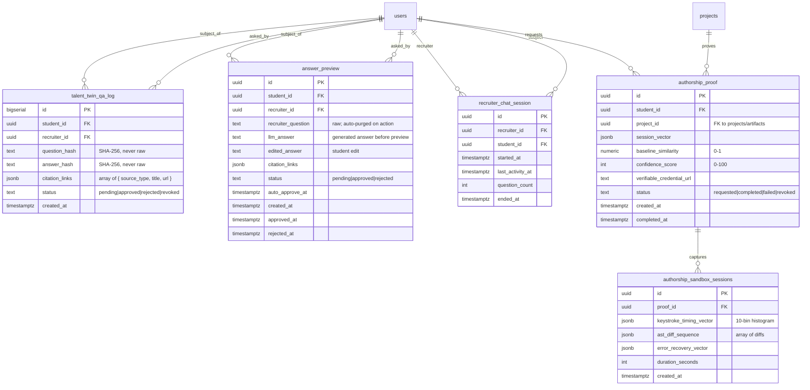

# Data Model: 010 — AI Talent Twin

**Date**: 2026-06-08
**Status**: Phase 1 design ratified; 1 additive migration (053)
**Builds on**: 001-009 schema (52 existing migrations); 5 new tables, GIN indexes on existing source tables

## Migration map

| Migration | Tables Added | Indexes Added on Existing Tables | Notes |
|---|---|---|---|
| `053_talent_twin.sql` | `talent_twin_qa_log`, `answer_preview`, `recruiter_chat_session`, `authorship_proof`, `authorship_sandbox_sessions` | GIN `(student_id, source_type)` on 6+ existing source tables | 5 new tables; no extended tables; no destructive changes |

Total new tables: **5**. Total extended tables: **0** (all indexes added are new, not modifying existing columns).

---

## ER diagram



---

## `talent_twin_qa_log`

Append-only audit log for every recruiter Q&A interaction. Stores only hashes — never raw question/answer text. This table is immutable after insert (no UPDATE/DELETE by application code).

| Column | Type | Constraints | Notes |
|---|---|---|---|
| `id` | bigserial | PK | Monotonic; used for cursor-based pagination |
| `student_id` | uuid | NOT NULL, FK `users(id)` ON DELETE CASCADE | The student being asked about |
| `recruiter_id` | uuid | NOT NULL, FK `users(id)` | The recruiter who asked |
| `question_hash` | text | NOT NULL | SHA-256 of the recruiter's question (never the raw text) |
| `answer_hash` | text | NOT NULL | SHA-256 of the LLM-generated answer |
| `citation_links` | jsonb | NOT NULL, default `'[]'::jsonb` | Array of `{ source_type: string, title: string, url: string }` |
| `status` | text | NOT NULL, default `'pending'`, CHECK in (`'pending'`, `'approved'`, `'rejected'`, `'revoked'`) | Current state in the student preview queue |
| `created_at` | timestamptz | NOT NULL, default `now()` | |

**Indexes**:
- `(student_id, created_at DESC)` — per-student Q&A history
- `(recruiter_id, created_at DESC)` — per-recruiter Q&A history
- `(question_hash, student_id)` — dedup check for identical questions

**RLS**: students see own Q&A (where `student_id = auth.uid()`); recruiters see own Q&A (where `recruiter_id = auth.uid()` + only rows where `status = 'approved'`); service role full.

**Retention**: Indefinite (append-only by design; raw data never stored here). If student revokes access, rows are updated to `status = 'revoked'` (the hash remains for audit but the row is excluded from recruiter queries).

---

## `answer_preview`

Ephemeral table holding pending answers for student preview. Rows are auto-purged on approve/reject. Raw recruiter question and LLM answer are stored here temporarily.

| Column | Type | Constraints | Notes |
|---|---|---|---|
| `id` | uuid | PK, default `gen_random_uuid()` | |
| `student_id` | uuid | NOT NULL, FK `users(id)` ON DELETE CASCADE | |
| `recruiter_id` | uuid | NOT NULL, FK `users(id)` | |
| `recruiter_question` | text | NOT NULL | Raw question text; auto-deleted on action |
| `llm_answer` | text | NOT NULL | Generated answer before preview; auto-deleted on action |
| `edited_answer` | text | nullable | Student's edited version (if they chose to edit rather than raw reject) |
| `citation_links` | jsonb | NOT NULL, default `'[]'::jsonb | |
| `status` | text | NOT NULL, default `'pending'`, CHECK in (`'pending'`, `'approved'`, `'rejected'`) | |
| `auto_approve_at` | timestamptz | NOT NULL | `created_at + TALENT_TWIN_AUTO_APPROVE_HOURS` (default 24h) |
| `created_at` | timestamptz | NOT NULL, default `now()` | |
| `approved_at` | timestamptz | nullable | Set when student approves |
| `rejected_at` | timestamptz | nullable | Set when student rejects |

**Indexes**:
- `(student_id, status, created_at DESC)` — "my pending answers" query
- `(auto_approve_at)` — cron job scans for expired pending answers

**RLS**: students see own pending answers (`student_id = auth.uid()`); recruiters see only `status = 'approved'` rows for opted-in students; service role full.

**Retention**: Rows are deleted immediately on approve/reject action. The 24h auto-approve cron sweeps stale rows (sets status to `'approved'`, copies citation links to `talent_twin_qa_log`, then deletes).

---

## `recruiter_chat_session`

One row per recruiter chat session with a student's talent twin. Tracks session boundaries for UI pagination and abuse detection.

| Column | Type | Constraints | Notes |
|---|---|---|---|
| `id` | uuid | PK | |
| `recruiter_id` | uuid | NOT NULL, FK `users(id)` | |
| `student_id` | uuid | NOT NULL, FK `users(id)` | |
| `started_at` | timestamptz | NOT NULL, default `now()` | |
| `last_activity_at` | timestamptz | NOT NULL, default `now()` | Updated on each new question |
| `question_count` | int | NOT NULL, default 0, CHECK >= 0 | |
| `ended_at` | timestamptz | nullable | Set when recruiter explicitly ends session or 30min idle |

**Indexes**:
- `(recruiter_id, student_id, started_at DESC)` — recruiter's session list
- `(last_activity_at)` — idle session detection

**RLS**: recruiter sees own sessions; student sees sessions where they are the subject; service role full.

---

## `authorship_proof`

One row per authorship proof request. Tracks the proof lifecycle from request through sandbox session, vector comparison, and badge minting.

| Column | Type | Constraints | Notes |
|---|---|---|---|
| `id` | uuid | PK | |
| `student_id` | uuid | NOT NULL, FK `users(id)` ON DELETE CASCADE | |
| `project_id` | uuid | NOT NULL | FK to the project/artifact being proven (table varies by artifact type) |
| `session_vector` | jsonb | nullable | Stylometric fingerprint from the sandbox session; set on session completion |
| `baseline_similarity` | numeric(4,3) | nullable, CHECK 0..1 | Cosine similarity between session vector and 006 baseline |
| `confidence_score` | int | nullable, CHECK 0..100 | Mapped from similarity (see research.md D6) |
| `verifiable_credential_url` | text | nullable | URL to the minted W3C VC JSON document (set on successful mint) |
| `status` | text | NOT NULL, default `'requested'`, CHECK in (`'requested'`, `'completed'`, `'failed'`, `'revoked'`) | |
| `created_at` | timestamptz | NOT NULL, default `now()` | |
| `completed_at` | timestamptz | nullable | |

**Indexes**:
- `(student_id, created_at DESC)` — student's proof history
- `(project_id)` — artifact-scoped lookup

**RLS**: student sees own proofs; employer sees only completed proofs (where `status = 'completed'` and project is visible to them); service role full.

---

## `authorship_sandbox_sessions`

Per-session capture data for the sandboxed writing session. Each authorship proof may have multiple sessions if the first attempt failed (similarity < 0.7) and the student retries.

| Column | Type | Constraints | Notes |
|---|---|---|---|
| `id` | uuid | PK | |
| `proof_id` | uuid | NOT NULL, FK `authorship_proof(id)` ON DELETE CASCADE | |
| `keystroke_timing_vector` | jsonb | NOT NULL | 10-bin histogram: `{ bins: [50-100, ..., 450-500], counts: [int] }` |
| `ast_diff_sequence` | jsonb | NOT NULL | Array of `{ nodes_added, nodes_removed, max_depth_delta }` per diff |
| `error_recovery_vector` | jsonb | NOT NULL | `{ count, latencies_ms: [int], mean_latency_ms, median_latency_ms }` |
| `duration_seconds` | int | NOT NULL, CHECK >= 30 | |
| `created_at` | timestamptz | NOT NULL, default `now()` | |

**Indexes**:
- `(proof_id)` — all sessions for a proof request

**RLS**: student sees own session data; service role full; employer never sees raw session data (only the confidence score).

---

## GIN indexes on existing source tables

The following GIN indexes are added to support efficient per-student chunk queries for the RAG pipeline:

```sql
-- 002: GitHub commits (github_commits)
CREATE INDEX IF NOT EXISTS idx_github_commits_student_source
  ON github_commits USING gin (student_id, source_type);

-- 002: Pull requests (pull_requests)
CREATE INDEX IF NOT EXISTS idx_pull_requests_student_source
  ON pull_requests USING gin (student_id, source_type);

-- 003: DSA coach chat (dsa_coach_chat_logs)
CREATE INDEX IF NOT EXISTS idx_dsa_chat_student_source
  ON dsa_coach_chat_logs USING gin (student_id, source_type);

-- 004: Mock-interview transcripts (mock_interview_transcripts)
CREATE INDEX IF NOT EXISTS idx_mock_interview_student_source
  ON mock_interview_transcripts USING gin (student_id, source_type);

-- 004: Faculty grade comments (faculty_grade_comments)
CREATE INDEX IF NOT EXISTS idx_faculty_grade_comments_student_source
  ON faculty_grade_comments USING gin (student_id, source_type);

-- 006: IDE sessions (ide_sessions)
CREATE INDEX IF NOT EXISTS idx_ide_sessions_student_source
  ON ide_sessions USING gin (student_id, source_type);

-- 007: Curriculum lesson feedback (lesson_feedback)
CREATE INDEX IF NOT EXISTS idx_lesson_feedback_student_source
  ON lesson_feedback USING gin (student_id, source_type);

-- 008: Collab artifacts (collab_artifacts)
CREATE INDEX IF NOT EXISTS idx_collab_artifacts_student_source
  ON collab_artifacts USING gin (student_id, source_type);
```

Note: `source_type` is a text column on each table (some may need to be added as a generated column if not present). Each index enables fast per-student + per-source-type filtering during the chunking phase.

---

## Cross-table relationships (summary)

```
users
  ├── talent_twin_qa_log (student_id, recruiter_id)
  ├── answer_preview (student_id, recruiter_id)
  ├── recruiter_chat_session (recruiter_id, student_id)
  └── authorship_proof (student_id)

projects/artifacts
  └── authorship_proof (project_id)

authorship_proof
  └── authorship_sandbox_sessions (proof_id)

Existing source tables (read-only):
  github_commits, pull_requests           (from 002)
  dsa_coach_chat_logs                     (from 003)
  mock_interview_transcripts, faculty_grade_comments (from 004)
  ide_sessions, ide_aggregates            (from 006)
  curriculum_lessons, lesson_feedback     (from 007)
  collab_artifacts                        (from 008)
```

All new foreign keys cascade on user deletion (DPDP erasure). The `talent_twin_qa_log` is append-only but status-update-capable (SET `status = 'revoked'` on user revoke — the row is not deleted, only soft-labelled).

---

## RLS summary

| Table | student sees | recruiter sees | service role |
|---|---|---|---|
| `talent_twin_qa_log` | own (`student_id = me`) | own (`recruiter_id = me` + only `approved` rows) | full (INSERT + SELECT) |
| `answer_preview` | own pending (`student_id = me`) | only `approved` rows for opted-in students | full |
| `recruiter_chat_session` | sessions where subject | sessions where recruiter | full |
| `authorship_proof` | own proofs | only `completed` proofs for visible projects | full |
| `authorship_sandbox_sessions` | own sessions | none | full |

---

## Re-validation

- ✓ All 5 spec entities mapped to tables
- ✓ All FK references resolve to existing 001-009 tables or new tables in this migration
- ✓ All CHECK constraints align with spec FR-* rules
- ✓ All performance-critical queries have supporting indexes (including GIN on existing tables)
- ✓ All multi-tenant tables have RLS policy plan
- ✓ Migration is strictly additive (no dependencies on later migrations; no DROP/ALTER on existing)
- ✓ DPDP erasure is naturally supported (ON DELETE CASCADE on every user_id FK)
- ✓ Zero score contribution — no score aggregator changes needed
- ✓ No new extensions required — pgvector already enabled from 002/007
